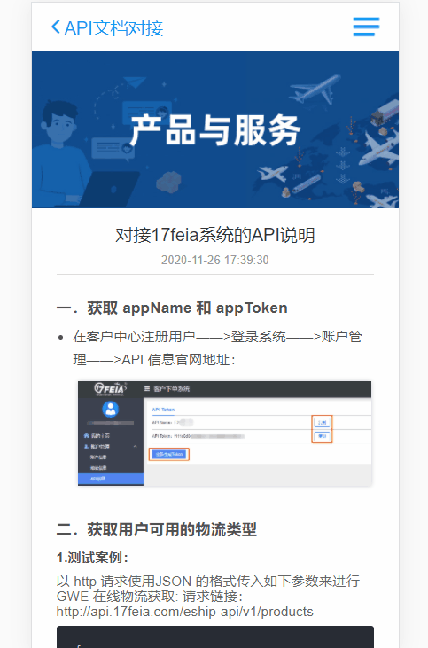
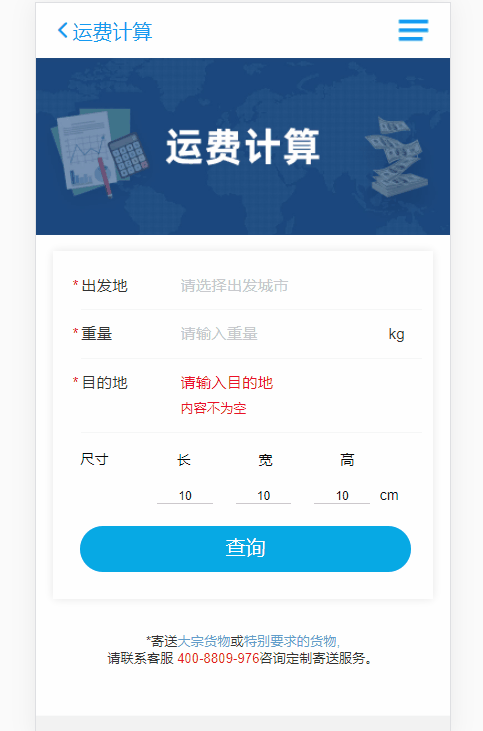

# 17feia 项目说明文档

## 项目介绍
17feia 项目主要为两端(PC端、移动端)官网，所涉及到首页公司介绍，业务说明，运费查询，文章管理系统等多个板块。其中PC端采用nuxt 技术，移动端通过postcss-plugin-px2rem实现适配。


## 前端所用技术框架选型
该项目 PC端   应用nuxt技术构造而成。
该项目 移动端 采用 vue 搭配 vant UI 框架构造。


## 项目重要技术点说明
### 1，移动端异形轮播图实现(UI部分)
- 实现效果如下:


- 采用swiper.js 实现轮播效果
```sh
  cnpm i swiper --save
```
- 在使用页面引入swiper
```sh

  import Swiper from 'swiper'
  import 'swiper/css/swiper.css'

```
- 初始化并进行相关配置
```sh

      mounted() {
        this.initSwiper()
      },
      methods: {
            initSwiper() {
                 this.swiper = new Swiper('.swiper-container',{
                  observer: true, // 当改变swiper样式或修改swiper的子元素时，自动初始化swiper，
                  observerParents: true,
                  effect: "slide", // 切换效果'slide(普通切换、默认)','fade('淡入')','cube(方块)','coverflow(3d流)','flip(3d翻转)'
                  centeredSlides: true, // 设置活动块居中
                  // spaceBetween: "18%", // slide中间的设置距离（单位PX）;
                  slidesPerView: "auto", // 设置slider容器能够同时显示的slides数量
                  loopedSlides: this.images.length+2, // 设置所要用到的loop个数（一般设置大于可视slide个数2个）
                  loop: true,
                  autoplay: false,
                  coverflowEffect: { // coverflow效果参数
                      rotate: 0, // slide做3d旋转时Y轴的旋转角度
                      stretch: -30, // 每个slide之间的拉伸值，越大slide靠的越紧，5.3.6后可使用百分比%
                      depth: 200, // slide的位置深度，值越大Z轴距离越远，看起来越小
                      modifier: 1, // 
                      slideShadows: false // 是否开启slide阴影
                  },
                });
            }
    }


```

- html 页面结构
```sh
   <div class="swiper-container">
          <div class="swiper-wrapper">
              <div class="swiper-slide ">
                   
                   <div class="custom-indicator"> 
                      <h2>资深行业经验</h2>
                      <p>16年深耕跨境物流，提供一站式B2C&B2B出口物流解决方案 在清关等关键环节具备明显优势</p>
                  </div>
              </div>
              <div class="swiper-slide ">
                
                <div class="custom-indicator">
                      <h2>专业个性化服务</h2>
                      <p>全球专线网络满足各类细分市场需求，多种派送服务自由选择 特殊货物品类、特殊寄送要求可定制渠道</p>
                </div>
              </div>
              <div class="swiper-slide ">
                 
                  <div class="custom-indicator">
                    <h2>智慧物流系统</h2>
                    <p>自主研发包裹处理系统，对接主流跨境电商ERP  便于服务商高效协同操作，客户物流信息全程实时可视化追踪</p>
                </div>
              </div>
          </div>
      
      </div>
```

- 相关css 样式参考
```sh
    .swiper-container {
        padding: 30px 0;
      }
      .swiper-container .swiper-wrapper .swiper-slide{
        width: 650px !important;
        overflow: hidden;
        background: transparent;
        transition: all 300ms ease 0s;
        transform: scale(0.94);
        -ms-transform: scale(0.94);
        -moz-transform: scale(0.94);
        -webkit-transform: scale(0.94);
        -o-transform: scale(0.94);
      }
      .swiper-container .swiper-wrapper .swiper-slide img {
        box-shadow: 0px 10px 26px 0px rgba(4, 0, 0, 0.26);
      }
      .swiper-container .swiper-wrapper .swiper-slide-active{
        transform: scale(1);
        -ms-transform: scale(1);
        -moz-transform: scale(1);
        -webkit-transform: scale(1);
        -o-transform: scale(1);
      }
      .swiper-container .swiper-wrapper .swiper-slide img{
        width: 100%;
      }
```

### 2，在路由跳转时对路由进行重定义(beforeCreate 钩子函数)
::: warning
  业务需求: 项目中在文章系统中，不同页面跳转到同一详情页面，但是路由前的title 需要动态设置，那么则需要在页面实例化前重定义路由title
:::
- 实现思路：在跳转页面运用 beforeCreate 钩子函数

```sh
    beforeCreate (vm) {
      this.$route.meta.title = this.$route.query.name
    },
```

### 3，移动端详情页在 v-html 的时候实现图片预览（通过vantui）

- 实现效果如下:



- 引入 vant 里面的 ImagePreview 图片预览组件

```sh

  import { ImagePreview } from 'vant';

```
-html 结构 

```sh
         <div   @click="getImg($event)">
           <p class="content" v-highlightjs v-html="articleInfo.content" ></p>
        </div>

```
- 方法

```sh
      getImg($event) {
      if($event.target.currentSrc) {
          ImagePreview({
          images:[
            $event.target.currentSrc
          ],
          showIndex:false
        })
      }
    
    },
```

### 4，移动端城市筛选匹配功能(参考vant IndexBar索引栏)

- 实现效果如下:



- 前台 html 结构

```sh
    <van-dialog v-model="show"  style=" margin-top:30px; ">
      <div >
         <van-sticky>
            <van-nav-bar title="选择城市" />
            <van-search v-model="search" placeholder="请输入关键词" @input="getVavle" />
        </van-sticky>
        <van-index-bar :sticky="false" style="height: 400px;overflow:auto;">
            <van-index-anchor :index="name" v-for="(item,name) in cityes" :key="name">
              <div>
                {{name}}
                <div v-for="(ele,idx) in item" :key="idx">
                  <b @click="getName(ele.name,ele.code)">{{ele.name}}</b>
                </div>
              </div>
            </van-index-anchor>
        </van-index-bar>
      </div>
       
    </van-dialog>


    getVavle (value) {
      this.dataFilter(value)
    }
```

- 根据后台返回数组进行改造成所需要的数组

```sh


    const state = {
      firstPin:["A","B","C","D","E","F","G","H","J","K","L","M","N","P","Q","R","S","T","W","X","Y","Z"]
    },
    const actions = {
      async getDeparturesAndDestinationsListA ({ commit, state, dispatch }, param) {
        let res = await getDeparturesAndDestinationsList();
        if(res.flag){
          commit('getDeparturesAndDestinationsListM', res.obj);
        }else {
          console.log('res', res);
        }
      },
    }

    const mutations = {
      getDeparturesAndDestinationsListM(state,data) {
              let arr2 = data.destinations['国际']
              let arrList = arr2
              let cityName = {}
              state.firstPin.forEach(item => {
                cityName[item] = []
                arrList.forEach(el => {
                  let first =el.quanPin.substring(0,1).toUpperCase()
                  if(first == item) {
                    cityName[item].push(el)
                  }
                })
              })
              state.cityes = cityName
              state.cityesCopy = cityName  //复制一个新的
            
      },
      dataFilter (state, data) {
        if (data) {
          let arr = []
          let cityName = {}
          state.destination.forEach((ele) => {
            if( ele.name.indexOf(data) != -1 || ele.nameEn.indexOf(data) != -1 || ele.quanPin.indexOf(data) != -1) {
              arr.push(ele)
              cityName['查询内容'] = []
              cityName['查询内容'].push(ele)
            }
          
          })
          state.cityes = cityName
        } else {
          state.cityes = state.cityesCopy
        }
      }       
    }


```