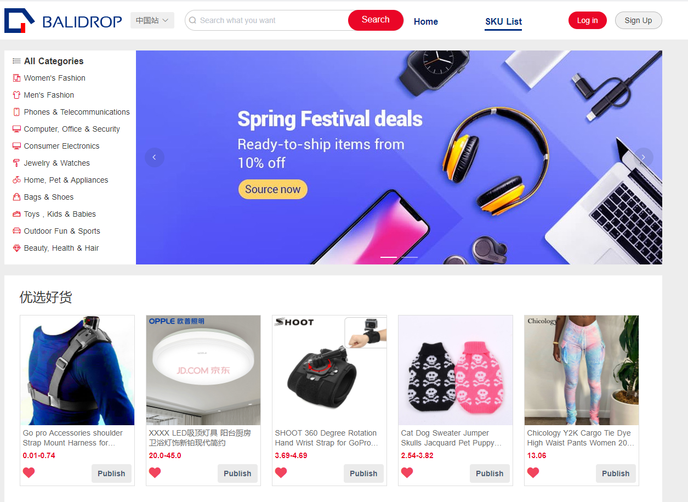
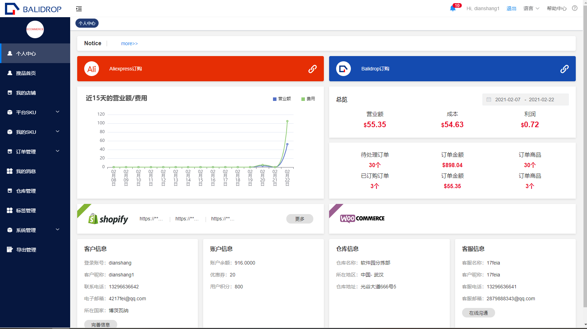
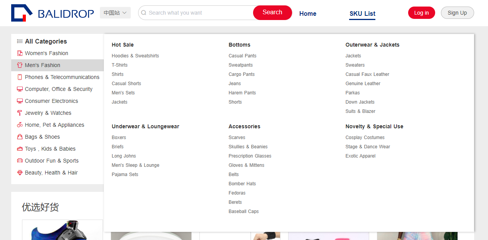
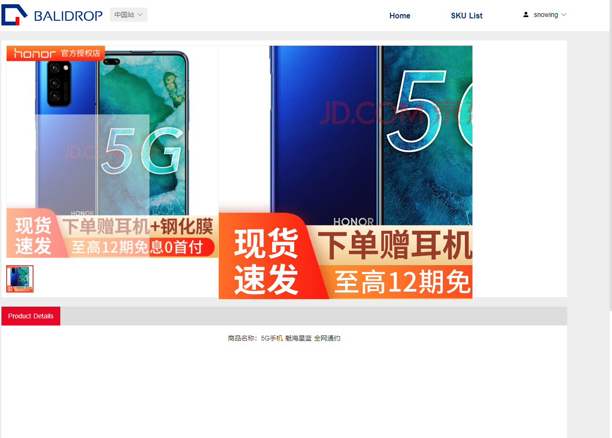

# balidrop 项目说明文档

## 项目介绍
balidrop 项目主要为仿CJdropshipping，致力于跨境选品分销平台。其中包括集成第三方店铺、集成物流系统，产品分销，一件代发等核心业务。为电商，供应商，平台三大主流用户服务。

balidrop 项目在前端开发中分官网，后台系统两大板块进行开发，项目展示集成一个域名 https://www.balidrop.com（登录账号 fankuai 登录密码 654321）

## 项目成果图展示
官网选品



balidrop 后台服务平台




## 前端所用技术框架选型
该项目 PC官网         应用 nuxt框架构造而成。

该项目 后台管理中心   采用 vue + element UI 框架构造。


## 项目重要技术点说明
### 1，悬停遮罩层效果(UI部分)
- 实现效果如下:



- 实现思路: 定位 + transition（elementui 过渡效果）

```sh
    <div class="testBox">
      <div class="box_left">
        <ul @mouseover="showContent = true" @mouseleave="showContent = false">
          <li>111</li>
          <li>222</li>
        </ul>
      </div>
      <div class="box_right"></div>
      <transition name="el-fade-in-linear" >
        <div v-show="showContent" class="transition_box">哈哈哈哈</div>
      </transition>
    </div>
```

### 2，商品放大镜效果(UI部分)
- 实现效果如下:



- 实现思路: 鼠标移入移出事件

```sh
  
```

