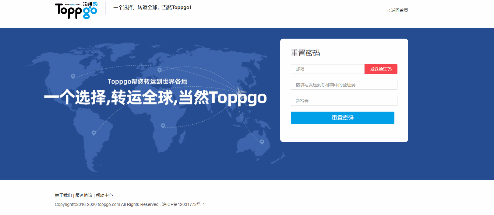

# Form 表单
## form 表单中对单个表单的验证

::: warning
  背景环境: 当在项目注册页面，验证邮箱需要发送验证码过程中，在点击验证码操作必须验证邮箱是否输入，则需用到整个表单中执行对单表单的空值验证。
:::




```sh
  this.$refs.form.validateField("email", errMsg => {
    if (errMsg) {
      console.log("校验未通过");
    } else {
      console.log("校验通过");
    }
  });

```