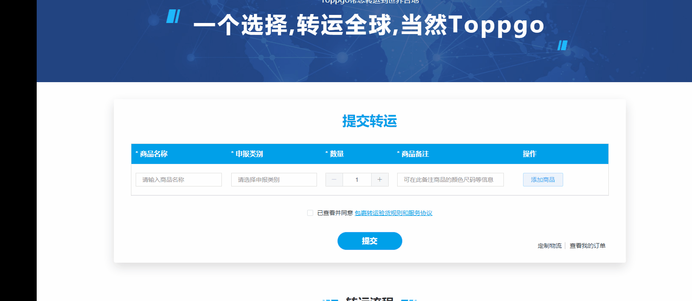

# Popover 弹出框
::: warning 
  使用场景:
  Popover弹出框，内容自定义设计，当选择对应内容，即隐藏弹框，鼠标放上再展示弹框，如下图所示:
:::



- 1，通过给 el-popove 标签绑定一个ref 属性；
- 2，在对应内容中执行click 事件 @click="scope._self.$refs[scope.$index].doClose()" ；

```sh
  <el-popover placement="top" width="160" :ref="scope.$index">
      <p>确定删除吗？</p>
      <div style="text-align: right; margin: 0">
          <el-button size="mini" type="text" @click="scope._self.$refs[scope.$index].doClose()">取消</el-button>
          <el-button type="primary" size="mini" @click="scope._self.$refs[scope.$index].doClose();;deleteThis(scope.row)">确定</el-button>
      </div>
      <el-button type="text" size="small" slot="reference">删除</el-button>
  </el-popover>

```