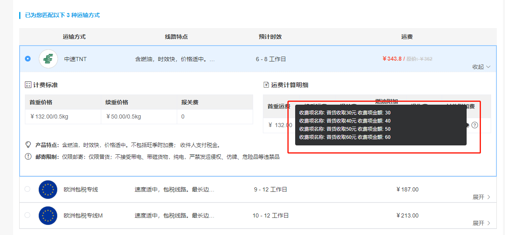

# el-tooltip 换行操作



- 通过设置 具名插槽 slot = "content" 便可以自定义内容及样式

```sh

   <el-tooltip   popper-class="tools" effect="dark" placement="right" v-if="item.surchargeList.length > 0">
      <div slot="content" v-for="(content,idx) in  item.surchargeList" :key="idx" style="min-width: 400px;">
        <p  style="line-height: 20px;">收费项名称: {{content.namei18n.zh}} 收费项金额: {{content.price}}</p>
      </div>
      <span class="iconfont iconbangzhu" style="margin-left: 5px;"></span>
    </el-tooltip>

```
# aaaa