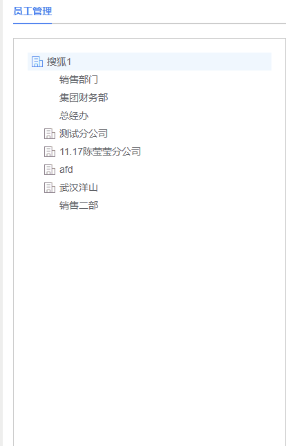
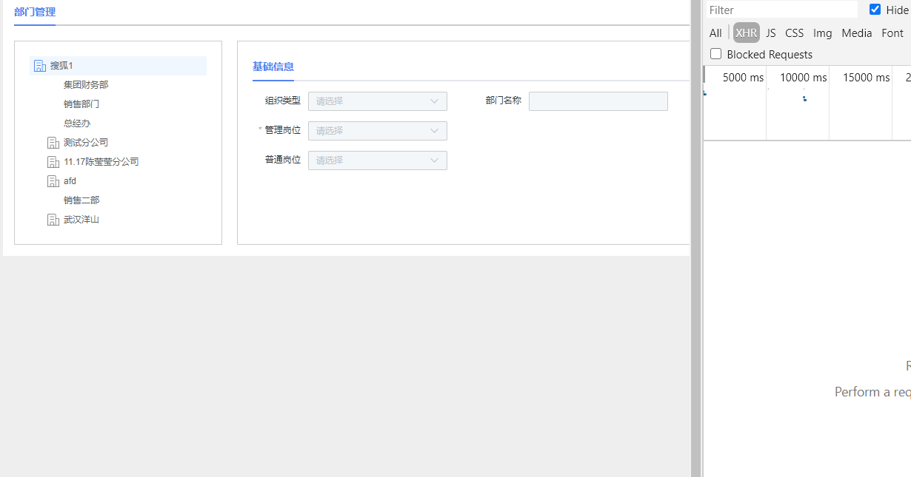
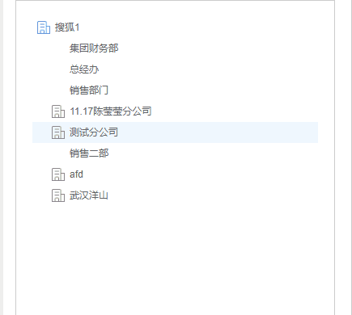

# tree 树形控件
## 1，基础用法

- props 配置基础数据

```sh

 <el-tree :data="treeData" :props="defaultProps"  node-key="id"
  :default-expanded-keys="defaultExpandedkeys" :expand-on-click-node="false"
   ref="treeRef">
 </el-tree>

  export default {
    data() {
      return {
        defaultProps: {
            children: 'children',  //子节点数组
            label: 'name'  //显示节点名称
        }
      }
    }
  }

```
- 更改tree 节点图标




```sh
  
    .el-tree /deep/ .el-tree-node__expand-icon.expanded{
      -webkit-transform: rotate(0deg);
      transform: rotate(0deg);
    }
    //有子节点 且未展开
    .el-tree /deep/ .el-icon-caret-right:before{
        background: url("../assets/image/companyStart.png") no-repeat 0 0;
        content: '';
        display: block;
        width: 16px;
        height: 16px;
        font-size: 16px;
        background-size: 16px;
    }
    //有子节点 且已展开
  .el-tree /deep/ .el-tree-node__expand-icon.expanded.el-icon-caret-right:before{
      background: url("../assets/image/company.png") no-repeat 0 0px;
      content: '';
      display: block;
      width: 16px;
      height: 16px;
      font-size: 16px;
      background-size: 16px;
  }

    //没有子节点(不显示图片)
    .el-tree /deep/.el-tree-node__expand-icon.is-leaf::before{
        background:  no-repeat 0 0px;
        content: '';
        display: block;
        width: 16px;
        height: 16px;
        font-size: 16px;
        background-size: 16px;
    }

```

## 2，实现同级部门拖拽功能

实现场景：



相关属性说明:
- draggable  ----el-tree中启动拖拽功能
- allow-drag ----判断节点能否被拖拽
- allow-drop ----拖拽时判定目标节点能否被放置 (type 参数有三种情况：'prev'、'inner' 和 'next')
- node-drop  ----拖拽完成时触发的事件

实现逻辑：

```sh
   <el-tree :data="treeData" 
      :props="defaultProps"
      node-key="id" 
      :default-expanded-keys="defaultExpandedkeys"
      :expand-on-click-node="false"
      ref="treeRef"
      draggable
      :allow-drag="allowDrag"
      :allow-drop="allowDrop"
      @node-click="handleNodeClick"
      @node-drop="handleDrop"
      :highlight-current="true">
   </el-tree>


  // 判断节点能否被拖拽
  allowDrag(draggingNode) {
    //根节点不能被拖拽，同级部门才能互相拖拽
    return draggingNode.data.parentId.indexOf('root') === -1;

  },
  //同级部门拖动(实现上下拖拽排序)
  allowDrop(draggingNode, dropNode, type) {
      if (draggingNode.level === dropNode.level) {
        if (draggingNode.parent.id === dropNode.parent.id) {
          // 向上拖拽 || 向下拖拽
          this.sortId.departmentId = draggingNode.data.id //拖拽元素传给后台
          this.sortId.targetDepartmentId = dropNode.data.id // 拖拽目标元素传给后台
          return type === "prev" || type === "next";
        }
      } else {
        // 不同级进行处理
        return false;
      }
  },
  // 拖拽完成(调用后台接口实现拖拽后刷新页面)
  handleDrop() {
      this.systDepartmentSortA()
  },

```
## 3，实现鼠标移入子节点，显示删除、修改、添加等功能按钮

实现场景：



相关属性说明:
- Slot        ----使用插槽自定义树节点的内容
- mouseenter  ----鼠标移入事件
- mouseleave  ----鼠标移出事件

实现逻辑:

 利用 鼠标进入(mouseenter) 和 鼠标移出 (mouseenter) 动态改变新增的一个del字段就能控制隐藏显示了

```sh
   <el-tree :data="treeData" 
      :props="defaultProps"
      node-key="id" 
      :default-expanded-keys="defaultExpandedkeys"
      :expand-on-click-node="false"
      ref="treeRef"
      :highlight-current="true">
       <span class="custom-tree-node" slot-scope="{node,data}">
         <span  @mouseenter="mouseenter(data)"  @mouseleave="mouseleave(data)" style="display: flex; align-items: center; ">
            <span>{{ node.label }}</span>
            <span style="margin-left: 10px;">
              <!-- 新增 -->
              <span v-if="data.del" style="">
                <span v-if="data.parentId == 'root' || data.nodeType == 'WAREHOUSE' " type="text" size="mini" @click="addFormData(data,node)" style="margin-right: 10px;">
                  
                </span>
              </span>
              <!-- 编辑 -->
               <span  v-if="data.parentId !== 'root'  && data.del" type="text" size="mini" @click="editFormData(data,node)" style="margin-right: 10px;">
                  
             </span>
             <!-- 删除 -->
             <span  v-if="data.parentId !== 'root' && data.nodeType == 'DEPARTMENT' && data.del" type="text" size="mini" @click="deleteDepartment(data,node)">
                  
             </span>
            </span>
         </span>
       </span>
    </el-tree>

    mouseenter (data) {
      this.$set(data, 'del', true)
    },
    mouseleave (data) {
      this.$set(data, 'del', false)
    },

```

## 4，el-tree 树形默认点击第一个node，并高亮

实现场景： 见上几个图

实现逻辑：

通过监听后台返回的树形结构数组，进行默认点击第一个节点

```sh
    
    watch: {
    // 默认点击第一个node 节点
    treeData (val) {
        if (val) {
          // 设置默认展开的数组
          this.defaultExpandedkeys.push(this.treeData[0].id)
          this.$nextTick(() => {
               const firstNode = document.querySelector('.el-tree-node')
               firstNode.click();

          });
      }
    }
  }

```
