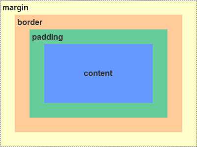

# css 知识点合集
::: warning
 CSS（Cascading Style Sheet）定义如何显示 HTML 元素，用于控制Web页面的外观。
:::


::: details 热门小贴士:
 CSS 编写前往往需要进行样式的清除，主要是为了<font color=red> 兼容不同浏览器 </font>，因为不同浏览器对一些标签的默认值是不同的。如果没有对CSS 初始化往往会出现浏览器之间页面显示差异。
:::

## 盒模型

**<font size= 5> 1，什么是 css 盒模型？</font>**

元素的外边距（margin）、边框（border）、内边距（padding）、内容（content）就构成了CSS盒模型。


<div style="text-align:center;">
    
    
</div>
<div style="text-align:center; font-size: 14px;">盒模型</div>


**<font size= 5> 2，IE盒模型<font size= 3 color=green>（怪异模式）</font>和 W3C盒模型 <font size= 3 color=green>（标准模式）</font></font>**

<div style="text-align:center;">
    
    
</div>
<div style="text-align:center; font-size: 14px;">IE盒模型</div>

- IE盒模型的计算方式为： width/height = content + padding + border

<div style="text-align:center; margin-top: 20px;">
    
    
</div>
<div style="text-align:center; font-size: 14px;">W3C盒模型</div>

- W3C盒模型的计算方式为： width/height = content


**<font size= 5> 3，盒模型的使用</font>**

```sh
    box-sizing: content-box | border-box | inherit
    //默认值为content-box
    // content-box: W3C盒模型
    // border-box: IE盒模型
    // inherit: 该属性的值应该从父元素继承
    
```

## Position
**<font size= 5> 1，position的定义？</font>**

::: warning
 position 属性规定元素的定位类型。这个属性定义建立元素布局所用的定位机制。任何元素都可以定位，不过绝对或固定元素会生成一个块级框，而不论该元素本身是什么类型。相对定位元素会相对于它在正常流中的默认位置偏移。
:::

**<font size= 5> 2，position属性值的使用</font>**

```sh
    position: static | inherit | relative | absolute | fixed | sticky

    // 默认值为static，没有定位
    // inherit: 继承父元素的position值
    // relative: 相对定位，相对于自己的初始位置，不脱离文档流
    // absolute: 绝对定位, 相对于最近的已定位祖先元素，脱离文档流
    // fixed: 固定定位，相对于浏览器定位
    // sticky: 粘性定位
    
```

## 页面布局
**<font size= 5> 1，两列定宽，中间自适应</font>**

- <font color= red> flex 布局法：</font>

```sh
  html {
    width: 100%;
    height: 100%;
  }
  body {
    width: 100%;
    height: 100%;
  }
  .container {
    width: 100%;
    height: 100%;
    display: flex;
    .leftBox {
      width: 160px;
      background-color: red;
    }
    .middleBox {
      flex: 1;
      height: 100%;
      background-color: blue;
    }
    .rightBox {
      width: 160px;
      height: 100%;
      background-color: pink;
    }
  }
```

- <font color= red>position 定位布局法：</font>

    1，要注意div 的<font color= orange> 排版顺序 </font>（中间盒子放在最后一个）。

    2，中间盒子不给宽度自适应，两侧盒子绝对定位，分别左侧右侧定位。

```sh
    html{
      width: 100%;
      height: 100%;
    }
    body {
      width: 100%;
      height: 100%;
    }
    .container {
      position: relative;
      width: 100%;
      height: 100%;
    }
    .leftBox {
      position: absolute;
      left: 0;
      top: 0;
      width: 160px;
      height: 100%;
      background-color: red;
    }
    .middleBox {
      height: 100%;
      margin-left: 160px;
      margin-right: 160px;
      background-color: blue;
    }
    .rightBox {
      position: absolute;
      top: 0;
      right: 0;
      width: 160px;
      height: 100%;
      background-color: pink;
    }
```

## BFC
::: details
  BFC（Block formatting context）块级格式上下文。它是一个独立的渲染区域，只有Block-level box参与， 它规定了内部的Block-level Box如何布局，并且与这个区域外部毫不相干。
:::


- <font color= red>1，BFC 的作用：</font>

* 利用BFC避免margin重叠；
* 自适应两栏布局；
* 清除浮动；


- <font color= red>2，如何创建一个BFC：</font>

* float的值不是none；
* position的值不是static或者relative；
* display的值是inline-block、table-cell、flex、table-caption或者inline-flex
* overflow的值不是visible；


以下代码为一个上下文环境，会产生margin 外边距重叠问题~

```sh
<p>这是第一个</p>
<p>这是第二个</p>


p {
  width: 100px;
  height: 200px;
  border: 1px solid #ccc;
  margin: 30px;
}
    
```

通过加一个 div 包裹，增加一个BFC ，就可以完美解决外边距重叠问题

```sh
<p>这是第一个</p>
<div class="bfc">
    <p>这是第二个</p>
</div>

.bfc {
  overflow: hidden;
}
p {
  width: 100px;
  height: 200px;
  border: 1px solid #ccc;
  margin: 30px;
}
```


## CSS 预处理器

::: warning
  css 预处理器基本思想就是，用一种专门的编程语言，为CSS 增加了一些编程的特性，将CSS 作为目标生成文件，以供项目使用。
:::


**<font  color= red> 1，CSS 预处理器都有哪些？</font>**

 * sass
 * less
 * stylus

 **<font  color= red> 2，为什么要使用 CSS 预处理器？</font>**

 * css 语法没办法嵌套书写，导致模块化开发缺乏效率；
 * 没有变量和合理的样式复用机制，难以维护

 **<font  color= red> 3，less  和 sass  的区别？</font>**

 下面主要从三个方面进行比较，分别是变量、输出设置、编译环境。

 - 变量的定义（<font  color= red> sass 主要通过$ 来定义变量，而less 主要通过 @ 来定义变量。</font>）

 ```sh
  // sass
  $font-size: 10px;
  $font-family: Helvetica, sans-serif;

  body {
    font: $font-size $font-family;
  }

  // less
  @color: red;
  content {
    color: @color;
  }
 ```

 - 输出设置

 sass 的输出方式有四种： NESTED, COMPACT, COMPRESSED 和 EXPANDED

 less 没有输出设置。


 - 编译环境

 sass 在服务端编译，而less 在浏览器进行编译。


