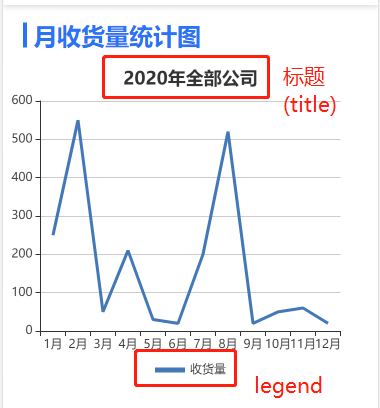
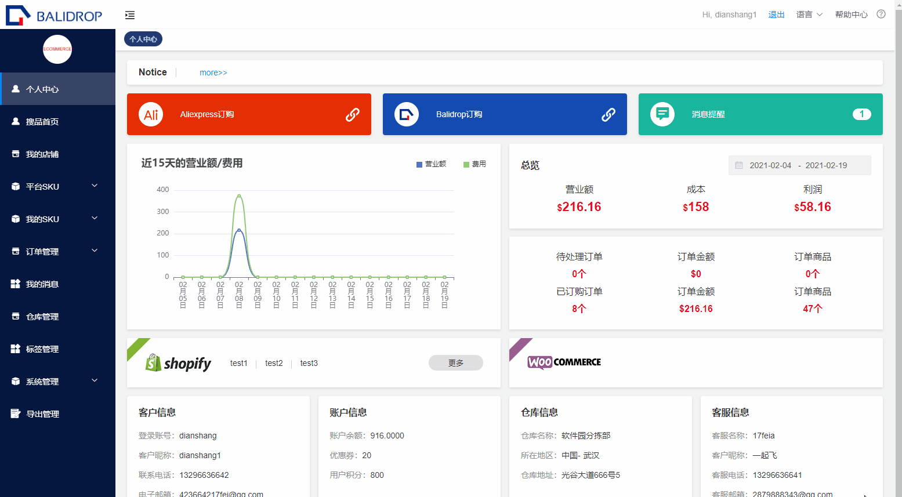

# echarts 图表学习

## 全局安装echarts
你可以使用如下命令安装
```sh
  npm install echarts --save
```
## 引入echarts
在 vue 入口文件 main.js 种引入注册
```sh
  import Echarts from 'echarts'
  Vue.prototype.echarts = Echarts 
  Vue.use(Echarts)

```

## 实例演练
以echarts 官网折线图为例(新建一个vue页面)
:::  warning
  !!!一定要注意的是canvas 盒子要给固定高度(根据需要随意定制)，不然没有效果
:::
```sh
  <div id="myChartChina" class="china_map_box" :style="{width: '100%', height: '300px'}">
```
初始化echarts 数据
```sh
  initChart(){
    var infoChart = this.echarts.init(document.getElementById('myChartChina'));
    infoChart.setOption(this.option);
  }
    
```
在data 里面定义echarts 所需的option(具体配置见下篇)
```sh
  data(){
    return{
      option: {
          title: {
              text: '2020年全部公司',
              x:'center',
              y:'top',
        },
        color:["#4278b8"],
        legend: {
            icon:'rect',
            itemWidth: 30,
            itemHeight: 5,
            bottom: -5,
            data: ['收货量'],
        },
        xAxis: {
            type: 'category',
            axisLabel:{interval:0},
            data: ['1月', '2月', '3月', '4月', '5月', '6月', '7月','8月','9月','10月','11月','12月']
        },
        yAxis: {
            type: 'value'
        },
        grid: {
            top: 35,
            width:'auto',
            height:'230px'
        },
       
        series: [{
            name: '收货量',
            symbol:'none', //这句就是去掉点的
            data: [250, 550, 50, 210, 30, 20,200, 520,20,50,60,20],
            type: 'line',
            lineStyle:{
                normal: {
                color: '#4278b8',
                width: 3,
              }
            },
           
        }]
      }
    }
  }
```
在页面渲染完成的时候调用echarts 初始化方法
```sh
   mounted () {
      this.initChart()
  },
```

## echarts option 的相关参数配置
- <font face="黑体" color= red  size= 5>title     -----表格标题</font>



```sh
  title:{
        text: '2020年全部公司',
        x:'center',  //居中对齐
        y:'top',  //上居中
      },
```

- <font face="黑体" color= red  size= 5>legend     -----表格提示图例</font>
```sh
  color:["#4278b8"],  //控制图例的颜色，如果有多个图例，数组则有多个，顺序是从右到左
  legend: {
      icon:'rect',  //字段控制形状  类型包括 circle rect line roundRect triangle diamond pin arrow none,也可自定义图片 'image://'
      itemWidth: 30,  //设置宽度
      itemHeight: 30, //设置高度
      bottom: -5,  //图标距离echarts 图标下距离
      itemGap: 40, //设置间距
      data: ['收货量'],  //图标名称的数组，可为多个
  },
```
- <font face="黑体" color= red  size= 5>grid     -----调整折线图的位置(图标单元格)</font>
```sh
  grid: {
      top:"20px", //或者直接写数字即可
      left: '2%',
      right: '9%',
      bottom: '5%',
      width:'auto',  //设置单元格的固定宽高
      height: '230px'
      containLabel: true
  },
```
- <font face="黑体" color= red  size= 5>tooltip     -----提示框悬浮层</font>
```sh
   tooltip: {
        show: true, //是否显示
        formatter(value) {
            return `目标营业额: ${value.data.mubiao}亿 当前营业额: ${value.data.president}亿` ;
        },  //根据data绑定值动态渲染悬浮框内容
    
    },
    
```

- <font face="黑体" color= red  size= 5>series     -----表格数据及线条</font>
```sh
  series: [{
      name: '收货量',  //用来控制折线图的图例显示
      symbol:'none', //数值点的形状，假如折线图不需要点，则设置为none
      data: [250, 550, 50, 210, 30, 20,200, 520,20,50,60,20], //数据
      type: 'line',  //数值点的表现形式 line--折线型  bar--条状型  pie---饼型 scatter---散点图  effectScatter--涟漪特效散点图  radar--雷达图 tree--树状图 map--地图 lines--线路图...
      barWidth : 10,//柱图宽度
      lineStyle:{  //折线的样式和颜色
          normal: {
          color: '#4278b8',
          width: 3, 
        }
      },
       itemStyle: { //数值点的样式
          normal:{
          color: '#d1e2ff',
          label: {
            show: true,//默认是否显示省份名称    
            textStyle: {
                color: "#fff"
            }
          },
        },
      },
      emphasis: {
          label: {
              show: true,//选中状态是否显示名称
          },
          areaStyle: {
              color: '#d1e2ff',//选中状态的颜色
          },
      },
           
   }]
```

## echarts 图表自适应
以echarts 折线图为例(新建一个vue页面)
:::  warning
  实现需求：当浏览器发生resize事件的时候，让其触发echart的resize事件，重绘canvas
:::



```sh
    mounted() {
      var myChart = echarts.init(document.getElementById('main'));
      window.onresize = myChart.resize
    },

```
用window.onresize = myChart.resize; 可以完成自适应，就是把window的onresize事件赋值为echart的resize事件.(单个图表的情况)

多个图表可以使用addEventListener
```sh

  window.addEventListener("resize", () => { 
      this.myChart.resize();  
      this.myChart2.resize();  
      this.myChart3.resize();
  });

```
