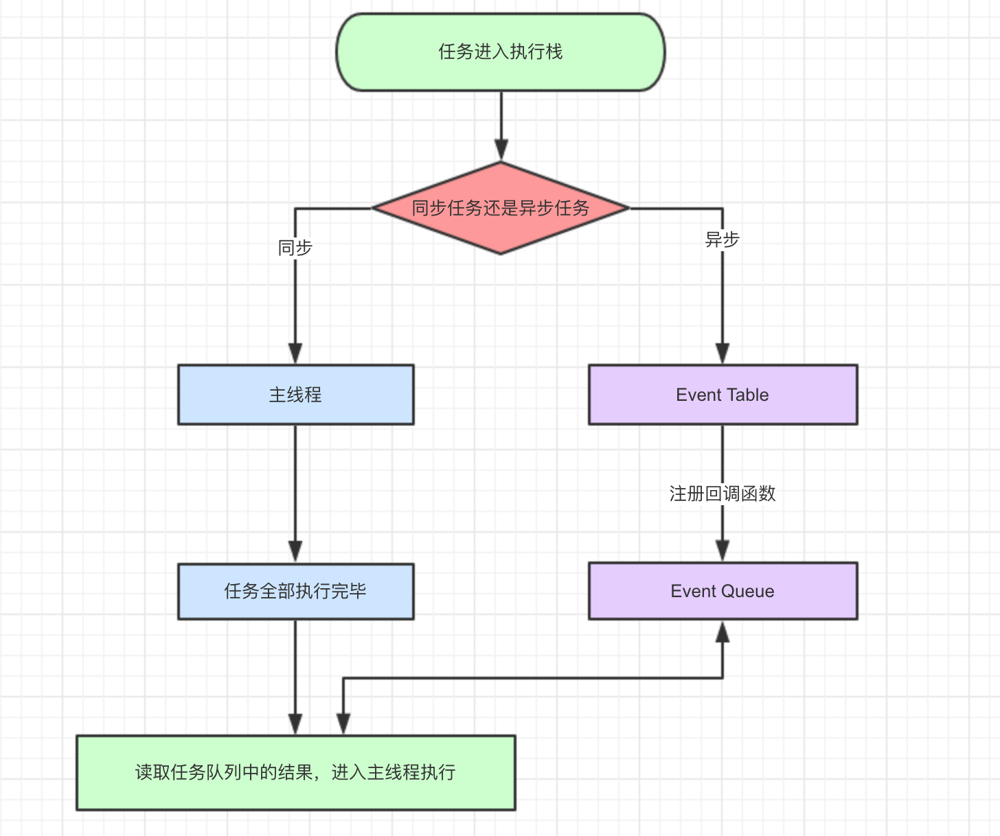

# js 知识点合集
::: warning
   JavaScript 是属于 HTML 和 Web 的编程语言。有函数优先的轻量级，解释型或即时编译型，常作为开发Web 页面的脚本语言。
:::

## 数据类型

* String：字符串类型
* Boolean：布尔类型，true or false
* Number：线性的事物，大小和次序分明
* Undefined：代表一切未知的事物（声明对象未定义）
* Null：空对象指针
* Symbol：Symbol 类型的对象永远不相等，用于解决属性名冲突（ES6新增）

以上属于基本数据类型，JS引用数据类型（复杂数据类型）有object,包括：
* Object  
* Array
* function
* Date

**<font size= 5> 1，如何判断数据类型？</font>**
* <font size= 5 color=red> typeof </font> 操作符(返回的类型都是字符串形式，并且对于引用数据类型除了function 返回 function 类型外，其他均返回 object。不适宜判断复杂数据类型)

```sh
    console.log(typeof(NAN))-----number
    console.log(typeof(null))-----object
```

* <font size= 5 color=red> instanceof </font> 用于判断一个变量是否为某个对象的实例，会返回ture 或 false

```sh

     let arr = []
     console.log(arr instanceof Array) // true

```

* <font size= 5 color=red> constructor </font>(较少应用)

* <font size= 5 color=red> Object.prototype.toString.call </font>(强烈推荐)

```sh

    console.log(Object.prototype.toString.call('')) ;   // [object String]
    console.log(Object.prototype.toString.call(1)) ;    // [object Number]
    console.log(Object.prototype.toString.call(true)) ; // [object Boolean]
    console.log(Object.prototype.toString.call(Symbol())); //[object Symbol]
    console.log(Object.prototype.toString.call(undefined)) ; // [object Undefined]
    console.log(Object.prototype.toString.call(null)) ; // [object Null]
    console.log(Object.prototype.toString.call(new Function())) ; // [object Function]
    console.log(Object.prototype.toString.call(new Date())) ; // [object Date]
    console.log(Object.prototype.toString.call([])) ; // [object Array]
    console.log(Object.prototype.toString.call(new RegExp())) ; // [object RegExp]
    console.log(Object.prototype.toString.call(new Error())) ; // [object Error]
    console.log(Object.prototype.toString.call(document)) ; // [object HTMLDocument]
    console.log(Object.prototype.toString.call(window)) ; //[object global] window 是全局对象 global 的引用

```

**<font size= 5> 2，堆和栈</font>**

::: details 热门小贴士:
    堆和栈在计算机领域，属于两种数据结构。它们只能在一端(称为栈顶(top))对数据项进行插入和删除。
    堆：存放引用数据类型，队列优先,先进先出。
    栈：存放基本数据类型，是一种先进后出的数据结构。
:::

- 基本数据类型

对于基本数据类型，是存放在栈内存中。如果进行复制，系统会自动为新的变量在栈内存中分配一个新值。

- 引用数据类型

对于引用数据类型，是存放在堆内存中。如果进行复制，系统也会自动为新的变量在栈内存中分配一个值，但这个值只是一个地址，会指向堆内存中的同一个对象。

- 为什么进行这样的存储？

   1，堆比栈大，栈比堆速度快。

   2，基础数据类型比较稳定，而且相对来说占用的内存小
   
   3，引用数据类型大小是动态的，而且是无限的。

   4，堆内存是无序存储，可以根据引用直接获取。

**<font size= 5> 3，浅拷贝和深拷贝</font>**

::: warning
  深浅拷贝主要是针对JS引用数据类型的拷贝，浅拷贝主要是对象的引用。原值发生变化，复制后的新值也会随之变化。深拷贝，拷贝的值不会随原对象的改变而改变。
:::


实现深拷贝的方法？ 

- <font size= 5 color=red > Object.assign </font> (对一级对象进行深拷贝，二级对象则为浅拷贝)

```sh

    var obj = {name: 'cyy',hobby:{type: 'read'}}
    var newObj = {}
    Object.assign(newObj, obj)
    obj.name = 'wc'
    obj.hobby.type = 'sport'
    console.log(newObj)  //{name: 'cyy',hobby:{type: 'sport'}}
    console.log(obj)    // {name: 'wc',hobby:{type: 'sport'}}

```

- <font size= 5 color=red>  JSON.parse 和 JSON.String </font> (只能对可以转换为JSON格式的对象进行拷贝，function不行)

```sh

    var obj = {name: 'cyy',hobby:{type: 'read'}}
    var newObj = {}
    newObj = JSON.parse(JSON.stringify(obj))
    obj.name = 'wc'
    obj.hobby.type = 'sport'
    console.log(newObj) //{name: 'cyy',hobby:{type: 'read'}}
    console.log(obj)  //{name: 'wc',hobby:{type: 'sport'}}

    var obj = [1,[2,3]]
    var newObj = []
    newObj = JSON.parse(JSON.stringify(obj))
    obj[0] = 2
    obj[1][0] = 6
    console.log(newObj) //[1,[2,3]]
    console.log(obj)  // [2,[6,3]]

```

- 递归方法

```sh
    function _deepClone(source) {
        let target;
        if (typeof source === 'object') {
            target = Array.isArray(source) ? [] : {}
            for (let key in source) {
            if (source.hasOwnProperty(key)) {
                if (typeof source[key] !== 'object') {
                target[key] = source[key]
                } else {
                target[key] = _deepClone(source[key])
                }
            }
            }
        } else {
            target = source
        }
        return target
   }
```

详细更多方法参照 <https://github.com/yygmind/blog/issues/29>

## 作用域

::: details 热门小贴士:
    JS 执行上下文：是评估和执行javascript代码的抽象环境，当javascript运行的的时候，都是在执行上下文中。
    全局执行上下文：默认上下文，不在函数内部的代码都是在全局执行上下文中。会创建一个全局对象（window对象）,并将this 设置为这个全局对象。
    函数执行上下文：在函数被调用的时候会创建一个新的上下文。
    Eval 函数执行上下文：执行在 eval 函数内部的代码。（用得较少）
:::

**<font size= 5> 1，this绑定</font>**

在全局执行上下文中，this 的值指向全局对象。(在浏览器中，this引用 Window 对象)

在函数执行上下文中，this 的值取决于该函数是如何被调用的。如果它被一个引用对象调用，那么 this 会被设置成那个对象，否则 this 的值被设置为全局对象或者 undefined（在严格模式下）。

```sh
   let obj = {
      foo: function() {
        console.log(this)
      }
    }
    obj.foo()  //this 指向 调用的那个对象 {foo: f}
    let test = obj.foo 
    test() //this 指向 window
```

**<font size= 5> 2，var,let,const 区别？ </font>**

- <font size= 5 color= red> var : </font>声明变量，可以进行预解析，存在变量提升，可以反复修改，后值会覆盖前值。

- <font size= 5 color= red> let : </font>声明变量，不能进行预解析，有块级作用域。一般用于操作一般数据类型。

- <font size= 5 color= red> const : </font>声明变量，不能进行预解析，有块级作用域，声明的值不能进行随意更改。（数组可以）一般用于操作引用数据类型

```sh
    const a = 3
    a = 4
    console.log(4)  //Uncaught TypeError: Assignment to constant variable.

    let a = 3
    a= 4
    console.log(4)  //4

    const arr = [1,2,3]
    arr[0] = 4
    console.log(arr)  //[4, 2, 3]

    const obj = {name : 'cyy'}
    obj.name = 'wc'
    console.log(obj)  //{name: 'wc'}

    for(var i = 0; i < 5; i++ ){
        console.log(i)  // 0,1,2,3,4
     }
    console.log(i)  //5
```

一次性输出 0~5
```sh
    // let 的用法
     for (let i = 0; i < 6; i++) {
        setTimeout(function() {
            console.log(new Date, i);
        }, 1000);
    }
   // var 的用法
    for (var i = 0; i < 6; i++) {
            setTimeout(function(j) {
                console.log(new Date, i);
            }, 1000, j);
    }
```
依次输出 0~5(定时器乘循环的次数)
```sh
   for (let i = 0; i < 6; i++) {
        setTimeout(function() {
            console.log(new Date, i);
        }, 1000*i);
    }
```

用 promise 或者 async/await 如何实现呢？请参考 <https://juejin.cn/post/6844903474212143117#heading-0>

## 原型
## 继承

## call/apply/bind

::: warning
   call/apply/bind 都是用于改变函数体内的this 指向问题。（函数体内this 指向主要是根据函数是被哪个对象调用的，那么指向的就是该对象）
:::

下面分别论述三者间的区别及具体使用场景：

- <font size= 5 color= red> call :</font> 是属于所有 Function 的方法。也就是Function.prototype.call。 
```sh
    var person = {
      name: 'cyy',
      age: 25
    }
    function say(job) {
      console.log(this)  //this 指向声明的对象 {name: 'cyy', age: 25}
    }
    say.call(person,'pe')
```

- <font size= 5 color= red> apply：</font>也是属于所有Function的方法，也就是Function.prototype.apply。
```sh
    var person = {
      name: 'cyy',
      age: 25
    }
    function say(job) {
      console.log(this)  //this 指向声明的对象 {name: 'cyy', age: 25}
    }
    say.apply(person,['pe'])
```

两者间的区别是：call 的参数列表是一个个列出来的，apply 的参数列表是放到一个数组中。

- <font size= 5 color= red> bind ：</font>创建一个新的函数, 当被调用时，将其this关键字设置为提供的值。 

```sh
    var altwrite = document.write;
    console.log(altwrite)  //为一个函数
    altwrite.bind(document)('hello') //bind 会创建一个新的函数，调用的时候会将this 设置为新值
    altwrite.call(document,'hello')
```
## new, this
## promise

::: warning Introduction
是异步编程的一种解决方案，从语法上讲，promise 是一个对象。它有三种状态，pending(等待中)，fulfiled(成功状态)，rejected(失败状态)。它的出现主要是为了解决javascript 中回调地狱的问题，增加代码的可读性、可维护性。
:::


## async/await（es7语法）

::: warning Introduction
是异步编程的一种解决方案，为了解决promise 的不完美。如果promise 的回调中出现嵌套，依旧会出现回调地狱。async/await 提供了一种新的编写异步代码方式，以同步方式编写异步代码，代码简洁，十分友好。
:::


### 调用异步函数时会返回一个 promise 对象

```sh
      async function test() {
        return 'ok'
        throw new Error('error')  //
     }
     test().then(console.log, console.log)
```

- 当这个异步函数返回一个值时，promise 的 resolve 方法将会处理这个返回值
- 当异步函数抛出异常或者非法值时，promise 的 reject 方法将处理这个异常值


### await

await 操作符用于等待一个 Promise 返回结果或者某个直接的值，且 await 必须在异步函数 (async function) 上下文中使用。

```sh
    function sleep (second) {
        return new Promise((resolve, reject) => {
        setTimeout(resolve, second*1000)
        })
    }
    async function test () {
        console.log(new Date())
        await sleep(3)
        console.log(new Date())
    }
   test()

    // 输出结果为：
    Fri Mar 12 2021 10:40:32 GMT+0800 (中国标准时间)
    Fri Mar 12 2021 10:40:35 GMT+0800 (中国标准时间)
```

异步函数中执行 await 表达式，这将会使异步函数暂停执行并等待 promise 解析传值后，继续执行异步函数并返回解析值。

### async/await的优势

- 错误处理
try-catch 处理同步，异步错误。
```sh
   function getJSON(res) {
      return new Promise(function(resolve,reject) {
        res = {obj: 'cyy'}
        resolve()
      })
    }
    // 使用 promise
    function test () { 
        try {
            getJSON().then((res) => {
                var data = JSON.parse(res) // 此处会报错 SyntaxError: Unexpected token u in JSON at position 0
            })
        } 
        catch (e) {
            console.log(e)   // catch 无法捕捉到异常
        }
    }
    // 使用 async/await
    async function test () {
      try {
        var data = JSON.parse(await getJSON())
      } catch (e) {
        console.log(e) // catch 里面会捕捉到异常  SyntaxError: Unexpected token u in JSON at position 0
      }
    }
    test()
```
- 解决嵌套问题
```sh
    function test () {
     return promise1()
            .then(value1 => {
               return promise2(valu1)
            .then(value2 => {
                return promise3(value1, value2)
            })
        })
    }

    async function test () {
        var value1 = await promise1()
        var value2 = await promise2(value1)
        return promise3(value1, value2)
    }
```
- 代码更加简洁，优雅


## eventloop(事件循环)

::: details 热门小贴士:
    JavaScript 是一门单线程语言，异步，非阻塞。javascript 代码是从上至下执行的！
:::

- JavaScript的运行机制

  javascript 是单线程的。执行任务需一个完成后接下一个，那么在网页元素加载过慢的时候，不能一直等待页面。因此引发了同步和异步的概念。JavaScript执行代码的时候将所有任务放到执行栈，那么执行栈会区分同步任务或异步任务。同步任务将进入主线程，一个接一个执行完。与此同时，异步任务会有一个事件列表，事件列表中会执行一个回调函数，将异步任务放到事件队列中。当主线程的同步任务执行完成后，就会从事件队列中读取一个个异步任务。以上过程不断循环操作就叫 事件循环。
<div style="text-align:center;">
    
</div>

- 宏任务和微任务：

    macro-task(宏任务)：包括整体代码script，setTimeout，setInterval

    micro-task(微任务)：Promise，process.nextTick

 不同类型的任务会进入对应的Event Queue，比如setTimeout和setInterval会进入相同的Event Queue。

 事件循环的顺序，决定js代码的执行顺序。进入整体代码(宏任务)后，开始第一次循环。接着执行所有的微任务。然后再次从宏任务开始，找到其中一个任务队列执行完毕，再执行所有的微任务。听起来有点绕，我们用文章最开始的一段代码说明：

 ```sh
    setTimeout(function() {
        console.log('setTimeout');
    })

    new Promise(function(resolve) {
        console.log('promise');
        resolve()
    }).then(function() {
        console.log('then');
    })

    console.log('console');

    // 输出结果为：promise  console  then  setTimeout
 ```


 **1，这段代码作为宏任务，进入主线程**

 **2，先遇到setTimeout，那么将其回调函数注册后分发到宏任务Event Queue。(注册过程与上同，下文不再描述)**

 **3，接下来遇到了Promise，new Promise立即执行，then函数分发到微任务Event Queue**

 **4， 遇到console.log()，立即执行,**

 **5，好啦，整体代码script作为第一个宏任务执行结束，看看有哪些微任务？我们发现了then在微任务Event Queue里面，执行**
  
 **6，第一轮事件循环结束了，我们开始第二轮循环，当然要从宏任务Event Queue开始。我们发现了宏任务Event Queue中setTimeout对应的回调函数，立即执行。**

 **7，结束。**


## 浏览器渲染原理


