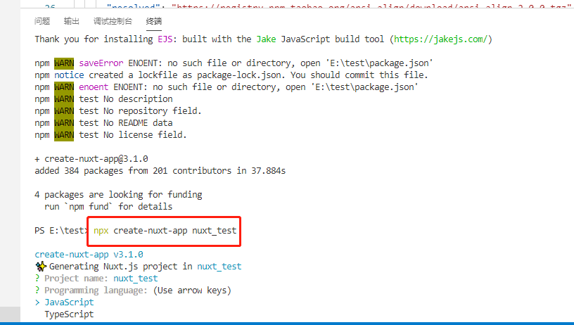
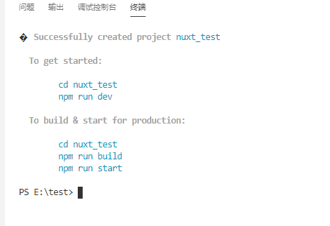

# 什么是nuxt?
::: warning
  基于 Vue.js 的服务端渲染应用框架.2016年10月产生！通过对客户端/服务端基础架构的抽象组织，Nuxt.js 主要关注的是应用的 UI 渲染。
:::
## 为什么要使用nuxt?
- 服务端渲染(更好的 SEO，搜索引擎的爬虫抓取工具可以直接查看完全渲染的页面,利于网站优先搜索到你的项目)
- HTML 头部标签管理
- 支持各种样式预处理器： SASS、LESS、 Stylus 等等
- 强大的路由功能，支持异步数据

## nuxt 的安装
对比vue 的脚手架------vue-cli,nuxt团队也创建了脚手架工具 create-nuxt-app。
注意:(确保已经安装了node)
```sh
  npm i -g create-nuxt-app  //(尽量使用管理员权限全局安装包)
  npx create-nuxt-app <项目名>
```




## nuxt 的启动
```sh
  cd <项目名>
  npm run dev (详情配置见 package.json 文件中的scripts配置)
```

## nuxt 的部署(配合pm2)
```sh
  npm run build //就是更新后的.nuxt 文件
```
- 在服务器新建一个项目的文件夹,例如: nuxt-web.将打包后生成的 .nuxt  nuxt.config.js package.json static 四个文件放入服务器中
- 因为nuxt 是服务端渲染的页面,所以是服务端启动项目,根据nuxt 中 package.json 中配置的start启动端口(如下所示)通过pm2启动
```sh
  {
  "name": "nuxt-web",
  "version": "1.0.0",
  "private": true,
  "scripts": {
    "dev": "nuxt",
    "build": "nuxt build",
    "start": "PORT=8899 nuxt start",
    "export": "nuxt export",
    "serve": "nuxt serve"
  },
  "dependencies": {
    "element-ui": "^2.13.2",
    "nuxt": "^2.13.0"
  },
  "devDependencies": {}
}
```
- 通过pm2 新增一个服务项目并查看(在项目根目录下执行pm2 相关命令符)
```sh
  pm2 start npm --name 'nuxtDemo' -- run start  
  pm2 list
```
- 配置nginx
通过nginx 的代理转发分发一个服务端口用于启动nuxt 项目,相关nginx 配置如下:
```sh
  server {
     listen       80;
     server_name  nuxt.yysime.cn;  //nuxt 项目启动的域名
	   location / {
			proxy_pass   http://127.0.0.1:8899;  //nuxt启动配置的端口号(对应nuxt 项目start 配置的端口号)
		}
  }

```