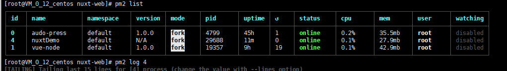

# pm2是什么?
:::  warning
  pm2是一个进程管理器，它能帮助你管理和保持应用在线。比如，服务器上需要开启多个node 端口，这时候你就可以通过pm2 来进行统一管理，管控各个端口。
:::
如下图所示:



## pm2 的安装(linux环境下)
- <font face="黑体" color= black  size= 5>全局安装</font>
```sh
  npm install pm2 -g
```
- <font face="黑体" color= black  size= 5>创建软连接</font>
```sh
  ln -s /root/node-v10.14.2-linux-x64/bin/pm2 /usr/local/bin/
```

## pm2 的相关使用命令
```sh
pm2 start npm --name 'nuxtDemo' -- run start  //创建一个新的pm2 项目
pm2 list           //查看管理的项目列表
pm2 restart 10    // 重启对应序号的项目服务
pm2 stop 10       // 停止对应序号的项目服务
pm2 del 10       // 删除对应序号的项目服务
pm2 logs       //显示实时日志

```