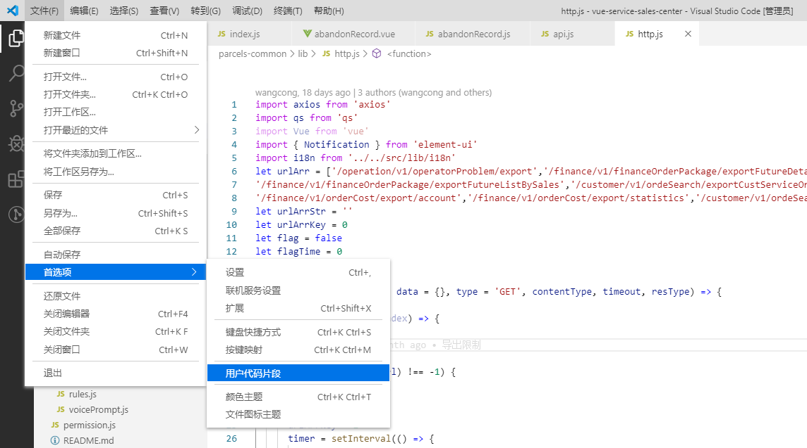

# 自定义代码片段
## vscode 设置代码片段
- 在vscode 中打开用户代码片段，为新制定的代码片段取名



- 制定vue 的代码片段
```
{
	  "Print to console": {
		    "prefix": "vue",
		    "body": [
		     "<template>",
		      " <div class=\" \">",
		      " </div>",
		      "</template>",
		      "<script>",
		      "export default {",
		      " name: '',",
		      " components: {},",
		      " props: {},",
		      " data () {",
		      "   return {}",
		      " },",
		      " computed: {},",
		      " created () {},",
		      " mounted () {},",
		      " methods: {}",
		      "}",
		      "</script>",
		      "<style lang=\"scss\">",
		      "</style>"
		   ],
		    "description": "Log output to console"
		   }
}
```
- 制定vuex 的代码片段
```
{
	 "vuex template": {
        "prefix": "vuex", //唤醒代码块的命令
        "body": [
		    "const state = {}"
		    "const actions = {}"
			"const mutations = {}"
			"const getters = {}"
			"export default {"
				"namespaced: true,"
				"state,"
				"mutations,"
				"actions,"
				"getters"
			"}"
        ], 
        "description": "httpCall template" //代码块的介绍
    }
}
```


- 使用的时候直接 vue/vuex +tab 即可补全