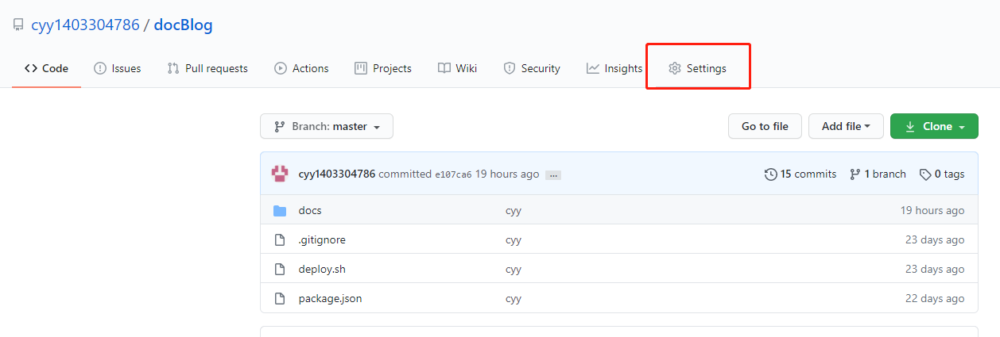
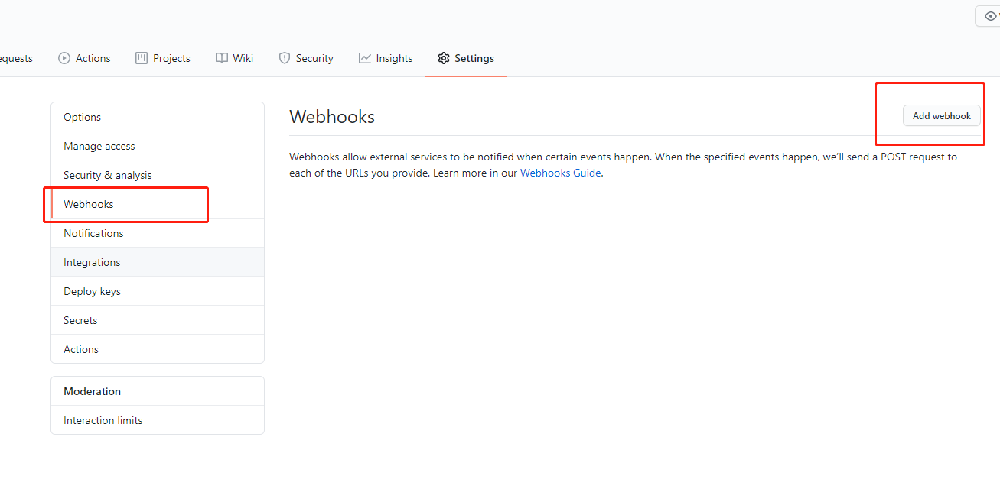
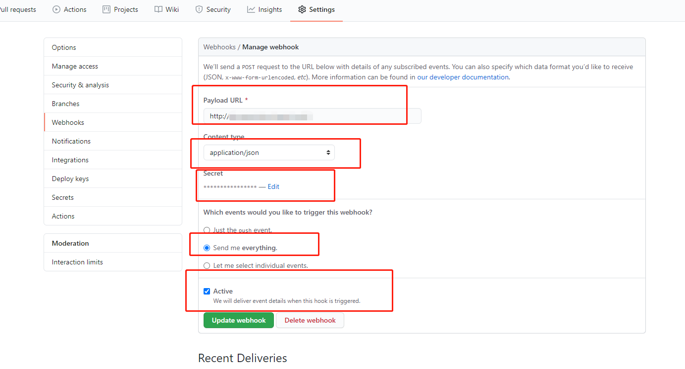
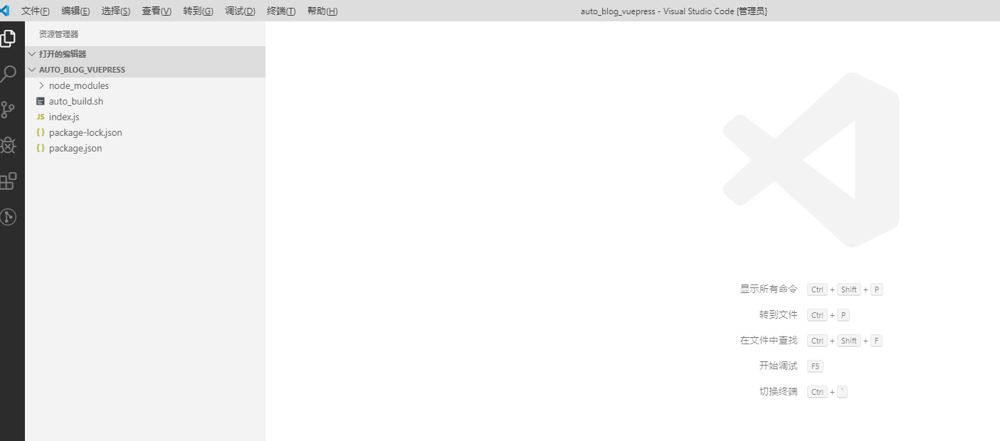

# webhook 是什么?
简单来讲,webhook就是你放在git仓库的一个通知员，一旦你的仓库里发生了什么事情，这个通知员就会用你留下的对应标记通知你

## 为什么要用到 webhook?
借助webhook，我们可以实现很多自动化流程。比如部署一个应用到服务器，本地提交代码后，只需要push 到git 仓库，github网站自动触发webhook，然后服务器上将本地提交的
最新代码用 git pull 抓取并进行重新部署

## 具体使用方法
- <font face="黑体" color= red  size= 5>-----在github 上打开对应项目，找到 seetings</font>


- <font face="黑体" color= red  size= 5>-----设置对应的webhook 选项</font>

:::  warning
  Payload URL : 这里是指定的一个应用的URL，该url对应的应用监听github 网站推送事件(http://自己的域名/path（随便取一个路径）)。
  Content type： application/json会将JSON payload直接放置POST的body中。
  Secret: 设置一个常用密码。
  Events： Events是webhook的核心。只要对存储库执行某项操作，就会触发这些webhook，服务器的有效负载URL会拦截并执行操作。
:::
- <font face="黑体" color= red  size= 5>-----配置接收和管理负载的服务器</font>
本地新建一个node项目,安装一个 github-webhook-handler 的中间件，可以使用 
```sh
  npm install -g github-webhook-handler //全局安装
```
新建一个index.js 文件，和一个 sh 脚本文件。生成如下项目目录

其中index.js 文件中配置的内容(参考https://www.npmjs.com/package/github-webhook-handler 网站)
```sh
    var http = require('http');
    var spawn = require('child_process').spawn;
    var createHandler = require('github-webhook-handler');

    // 下面填写的myscrect跟github webhooks配置一样，下一步会说；path是我们当时设置的访问路径
    var handler = createHandler({ path: '/auto_build', secret: 'ying4786' });   

    http.createServer(function (req, res) {
      handler(req, res, function (err) {
        res.statusCode = 404;
        res.end('no such location');
      })
    }).listen(6666);

    handler.on('error', function (err) {
      console.error('Error:', err.message)
    });

    // 监听到push事件的时候执行我们的自动化脚本
    handler.on('push', function (event) {
      console.log('Received a push event for %s to %s',
        event.payload.repository.name,
        event.payload.ref);

      rumCommand('sh', ['./auto_build.sh'], function( txt ){
        console.log(txt);
      });
    });

    function rumCommand( cmd, args, callback ){
      var child = spawn( cmd, args );
    }
```
设置 自动部署 脚本(本项目中的./auto_build.sh 文件)
```sh
  #! /bin/bash
  cd  /cyy/docBlog/docBlog  //服务器中放置的对应部署项目的文件夹路径
  git reset --hard
  git pull
  npm run build
```
将这个node服务项目推送到服务器上,通过pm2 启动此服务
至此。本地blog 项目可以完成在本地提交代码到仓库可以实时更新到线上的效果
