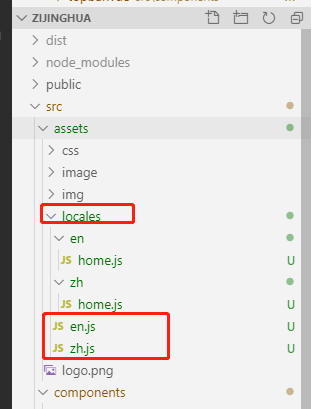

# 前端实现国际化操作
elementui 组件搭配 vue-i18n 实现多语言设置。结合项目需求，需进行三种语言的自由切换，并实现切换语言后在登陆默认有记忆功能，具体操作如下:
##  vue-i18n 使用方法
- <font face="黑体" color= red  size= 5>全局安装i18n 组件</font> 
```sh
   cnpm i vue-i18n -s
```
- <font face="黑体" color= red  size= 5>引入i18n国际化插件(新建 i18n.js  文件)</font> 
```sh
  import Element from 'element-ui'
  import VueI18n from 'vue-i18n'
  Vue.use(VueI18n)
```
- <font face="黑体" color= red  size= 5>提取项目中所有的中文字段进行国际化操作</font> 

结合vuex 文件管理办法，我们可以新建一个 locales 语言文件夹，包括中文、英文等语言，相应页面对应相应文件js 路径，如下图:



- <font face="黑体" color= red  size= 5>引入相关字段路径，进行国际化设置</font>

::: warning
  此处采取跟vuex 一样 用require.context 方法导出上下文，获取所有文字对象。
:::

```sh
  //引入本地的文字对象
  import zhmoduels from '../assets/locales/zh'
  import enmoduels from '../assets/locales/en'

  //导入elementui 自带组件的语言对象
  import enLocale from 'element-ui/lib/locale/lang/en'
  import zhLocale from 'element-ui/lib/locale/lang/zh-CN'

  //进行两个对象的合并操作(因页面上包含element组件文字及自己所定义的文字对象，所以需要进行合并操作)
   const locales = {
    zh: Object.assign(zhmoduels,zhLocale),
    en: Object.assign(enmoduels,enLocale),
  }
  //实例化i18n 对象
    const i18n = new VueI18n({
    locale: 'zh', // 此处即为定义的文字对象的key 值（语言名称）
    messages: locales,  // set locale messages
  })

    Vue.use(Element, {
      i18n: (key, value) => i18n.t(key, value)
    })

    export default i18n

``` 

- <font face="黑体" color= red  size= 5>入口文件中全局注册 i18n</font>

  在main.js  中引入 i18n.js 文件。
```sh
  import Vue from 'vue'
  import i18n from './lib/i18n'
  new Vue({
      i18n,
      router,
      store,
      render: h => h(App)
  }).$mount('#app')

```
- <font face="黑体" color= red  size= 5>实现国际化语言切换</font>

页面引入 i18n  文件，在对应切换语言方法中编码:

```sh
    languageChe(){
        this.reload() //页面重载(见 页面不刷新实现 reload 方法)
        i18n.locale = 'en'  //更改对应i18n 语言(此处可结合实际动态设置)
      }
```
##  vue-i18n 各情形下定义文字的方法
- vue 页面中渲染
```sh
    <h2>{{$t('home.最新文章')}}</h2>
```
- 组件中动态数据渲染
```sh
    <el-tab-pane :label="$t('home.问题标签列表')" name="1">
      <ProblemLabel></ProblemLabel>
    </el-tab-pane>
```
- sciprt中data 数据定义处
```sh
    data() {
      return {
        processName:[this.$t('home.待称重'),this.$t('home.待处理')],
        active: 0
      };
  },
```
- js 文件中
需先引入 i18n 文件
```sh
  import i18n from '../../lib/i18n'
  Notification({type: 'success', title: i18n.t('home.提示'), message: i18n.t('home.成功')})
```