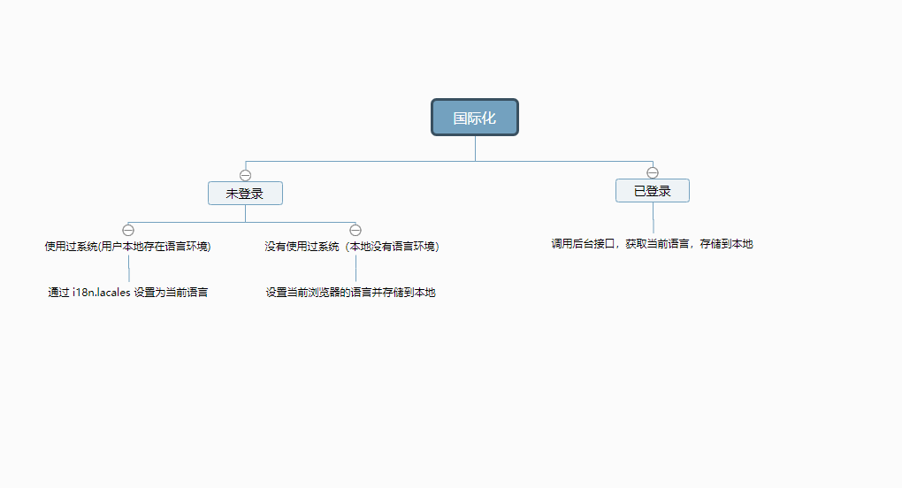

# parcels 项目说明文档

## 前端所用技术框架选型
该项目采用 vue 搭配 vue-cli3.0 脚手架，配合vuex 状态管理器 结合webpack 打包工具，采用 scss 扩展语言构造而成。

```sh
    vue + vue-cli3.0 + vuex + webpack + scss
```

## parcels 项目结构
```sh
├── dist                       # 项目打包生成文件夹
├── node_modules               # 项目依赖包
├── parcels-common             # 项目公用库(存储统一样式、资源，页面，方法的公用仓库模块)
├── public                     # 静态资源           
│   │── favicon.ico            # favicon图标(进入系统地址栏的小图标)
│   └── index.html             # html模板
├── src                        # 源代码
│   ├── assets                 # 主题,图片等静态资源
│         └── css              # 提取的公共css 文件
│         └── image            # 项目所需的图片文件夹
│         └── locales          # 国际化语言文件
│   ├── components             # 全局公用组件(页面组件和全局共用组件)
│   ├── lib                    # 公用方法
│         └── api.js           # 所有请求接口
│         └── i18n.js          # 国际化处理文件
│         └── index.js         # 版本控制文件
│   ├── pages                  # 所有页面
│         └── test.vue          
│   ├── router                 # 路由
│         └── index.js         # 定义页面所有路由路径
│   ├── store                  # 全局 store管理
│         └── modules 
│                  └── test.js # 对应页面的vuex.js 文件
│         └── index.js         # 总控所有js 文件，进行自动化导入
│   ├── utils                  # 该项目所属工具类文件夹
│   ├── App.vue                # 入口页面
│   ├── main.js                # 入口文件 加载组件 初始化等
├── .eslintignore              # eslint 配置项
├── .gitignore                 # git 配置项
├── .gitmodules                # 子模块 配置项(parcels-common)
└──  package.json              # package.json
├── vue.config.js              # vue-cli 配置文件

```
## parcels 重要项目点
### 引入公用库 parcels-common
::: warning
  背景环境: 由于<font face="黑体" color= red  size= 3> parcels</font> 项目包括五个子系统，各个系统间使用统一样式，存在共用页面，为避免重复页面编写，更改样式问题，
  我们采用公用库方法，统一管理公共资源(如：全局样式，全局方法，全局页面，共用图片资源等)。
:::


parcels-common 项目结构

```sh
├── assets                        # 静态资源           
│      └── css                    # 提取的公共css 文件
│      └── image                  # 项目所需的图片文件夹
│      └── locales                # 国际化语言文件
├── components                    # 全局公用组件(页面组件和全局共用组件)
├── layout                        # 页面布局公用页面文件夹
├── lib                           # 全局公用第三方方法库
│      └── api.js                 # 项目共用接口文件
│      └── http.js                # 接口封装请求
│      └── index.js               # 版本控制文件
├── pages                         # 系统共用页面
├── store                         # 全局 store管理
│      └── test.js                # 对应页面的vuex.js 文件
├── utils                         # 该项目所属工具类文件夹 
├── permission.js                 # 控制项目路由拦截及全局拦截等相关操作              

```

### 前端处理国际化 i18n 

::: warning
  背景环境: 由于<font face="黑体" color= red  size= 3> parcels</font> 项目需支持多国语言浏览，故需要进行页面的国际化操作。
  该项目主要采用前后端配合处理的形式实现国际化。此处简述前端处理国际化逻辑说明:
:::



### 前端工程自动化 require.context 

::: warning
  背景环境: require.context 是 Webpack 的一个 api,通过执行这个函数获取一个特定的上下文,主要实现自动化导入模块,
在前端工程中,如果遇到从一个文件夹引入很多模块的情况,可以使用这个api,它会遍历文件夹中的指定文件,然后自动导入,使得不需要每次显式的调用import导入模块
:::

场景分析:


使用方法:
```sh
  const fileNames = require.context('./modules',true,/\.js$/)  //第一个参数类型字符串(读取文件的路径)  第二个参数布尔类型(是否遍历文件的子目录), 第三个参数正则表达式(匹配文件的正则)
  console.log(fileNames.keys())  //返回匹配模块的数组
  let moduels = {}
  fileNames.keys().forEach((item) => {
  const moduleName = item.replace(/^\.\/(.*)\.\w+$/, '$1')  //获取路径名称
  const modeuleCotent = fileNames(item).default             //获取每个文件对象导出的内容
  moduels[moduleName] = modeuleCotent                       //组装vuex数据结构
})
```
- 在引入vuex 对应模块的时候用对象结构赋值的方法
```sh
    const store = () => new Vuex.Store({
      modules: {
        ...moduels
      }
    })
```

### 前端共用方法封装库

::: warning
  背景环境: 在大型系统中，为实现代码可读性和复用性，常见功能,如：正则校验规则，过滤筛选保留位数，时间型转换等都会进行统一封装并统一管理，需要使用
  的情况下，进行全局调用，节约开发时间及优化代码规范。
:::

详见 项目中 /parcels-common/utils (存放所有公共方法库)，下面以过滤方法举例:

- 全局过滤器
```sh
  // //将数字转为金额，保留两位小数
  Vue.filter('currency', function (val) {
  if(val == null || val == undefined){
    return "0.00";
  }
  val = val.toString().replace(/\$|\,/g,'');
  if(isNaN(val)) {
  val = "0";
  }
  let sign = (val == (val = Math.abs(val)));
  val = Math.floor(val*100+0.50000000001);
  let cents = val%100;
  val = Math.floor(val/100).toString();
  if(cents<10) {
  cents = "0" + cents
  }
  for (var i = 0; i < Math.floor((val.length-(1+i))/3); i++) {
      val = val.substring(0,val.length-(4*i+3))+',' + val.substring(val.length-(4*i+3));
  }

  return (((sign)?'':'-') + val + '.' + cents);
})

....  


```
- 在入口文件中引入相关文件
```sh
  import '../parcels-common/utils/filter' // 全局过滤方法
```
- 页面中直接使用定义好的值 例: currency
```sh
    <el-table-column :label="$t('custombill.金额')+'(￥)'" min-width="90">
    <template slot-scope="scope">
      {{ scope.row.price | currency }}
    </template>
  </el-table-column>
```

## parcels 系统打包及部署

### 使用说明
parcels 项目分为开发环境，测试环境和线上环境。
- 开发环境: 开发人员本地开发的环境。
- 测试环境: 模拟测试的环境(有独立的主机，但是不对外开放)
- 线上环境: 真实线上供客户使用的环境（有独立的主机，对所有人开放，开发人员只读）

parcels 项目测试环境下项目所属目录  (167服务器)  <font face="黑体" color= red  size= 5> /eship/code</font>  

通过sh 脚本执行自动化打包(<font face="黑体" color= red  size= 5> 09-vue-pull-and-build.sh</font> )
```sh
  #!/bin/bash
keyword=$1

# 打包
if [ -z $1 ] || [[ "vue-customer-center" =~ $keyword ]];then
	echo 更新vue-customer-center.........................................................
	cd /eship/code/vue-customer-center
	git reset --hard
	git pull
	cd /eship/code/vue-customer-center/parcels-common
	git reset --hard
	git pull origin master

	echo -e '\n\n'
    echo 开始打包vue-customer-center...
    cd /eship/code/vue-customer-center
    rm -rf dist
    cnpm run build
fi


if [ -z $1 ] || [[ "vue-finance-center" =~ $keyword ]];then
	echo 更新vue-finance-center.........................................................
	cd /eship/code/vue-finance-center
	git reset --hard
	git pull
	cd /eship/code/vue-finance-center/parcels-common
	git reset --hard
	git pull origin master

	echo -e '\n\n'

    echo 开始打包vue-finance-center...
    cd /eship/code/vue-finance-center
    rm -rf dist
    cnpm run build
fi

if [ -z $1 ] || [[ "vue-operation-center" =~ $keyword ]];then
	echo 更新vue-operation-center.........................................................
	cd /eship/code/vue-operation-center
	git reset --hard
	git pull
	cd /eship/code/vue-operation-center/parcels-common
	git reset --hard
	git pull origin master

	echo -e '\n\n'

    echo 开始打包vue-operation-center...
    cd /eship/code/vue-operation-center
    rm -rf dist
    cnpm run build
fi

if [ -z $1 ] || [[ "vue-product-center" =~ $keyword ]];then
	echo 更新vue-product-center.........................................................
	cd /eship/code/vue-product-center
	git reset --hard
	git pull
	cd /eship/code/vue-product-center/parcels-common
	git reset --hard
	git pull origin master

	echo -e '\n\n'

    echo 开始打包vue-product-center...
    cd /eship/code/vue-product-center
    rm -rf dist
    cnpm run build
fi

if [ -z $1 ] || [[ "vue-service-sales-center" =~ $keyword ]];then
	echo 更新vue-service-sales-center.........................................................
	cd /eship/code/vue-service-sales-center
	git reset --hard
	git pull
	cd /eship/code/vue-service-sales-center/parcels-common
	git reset --hard
	git pull origin master

	echo -e '\n\n'

    echo 开始打包vue-service-sales-center...
    cd /eship/code/vue-service-sales-center
    rm -rf dist
    cnpm run build
fi


if [ -z $1 ] || [[ "vue-author-center" =~ $keyword ]];then
	echo 更新vue-author-center..........................................................
	cd /eship/code/vue-author-center
	git reset --hard
	git pull
	cd /eship/code/vue-finance-center/parcels-common
	git reset --hard
	git pull origin master
	
	echo -e '\n\n'

    echo 开始打包vue-author-center...
    cd /eship/code/vue-author-center
    rm -rf dist
    cnpm run build
fi
# 运行


echo 打包完成...

```
parcels 项目线上环境下项目所属目录(211服务器) <font face="黑体" color= red  size= 5> /17feia/nfsOthersFiles/parcels/vue</font> 

通过sh 脚本执行自动化打包( <font face="黑体" color= red  size= 5> 10-vue-pull-and-build.sh</font> ) 

::: warning
  为避免重复切换服务器，这里采用ssh 远程连接服务器，配合scp 进行不同主机间的文件复制(parcels 项目线上部署的思想主要是通过复制测试环境的打包文件到线上环境进行部署，故用到此功能)。
:::

```sh
#!/bin/bash
keyword=$1

# 发布线上
if [ -z $1 ] || [[ "vue-author-center" == *$keyword* ]];then
	echo author更新到线上.....
	ssh  root@index.17feia.com cp /17feia/nfsOthersFiles/parcels/vue/vue-author-center/index.html /17feia/nfsOthersFiles/parcels/vue/vue-author-center/index.html.back 
	scp -r /eship/code/vue-author-center/dist/{favicon.ico,lib,static,index.html} root@index.17feia.com:/17feia/nfsOthersFiles/parcels/vue/vue-author-center/
fi

if [ -z $1 ] || [[ "vue-customer-center" == *$keyword* ]];then
	echo vue-customer-center更新到线上.....
	ssh  root@index.17feia.com cp /17feia/nfsOthersFiles/parcels/vue/vue-customer-center/index.html /17feia/nfsOthersFiles/parcels/vue/vue-customer-center/index.html.back 
	scp -r /eship/code/vue-customer-center/dist/{favicon.ico,static,index.html} root@index.17feia.com:/17feia/nfsOthersFiles/parcels/vue/vue-customer-center/
fi


if [ -z $1 ] || [[ "vue-service-sales-center" == *$keyword* ]];then
	echo vue-service-sales-center更新到线上.....
	ssh  root@index.17feia.com cp /17feia/nfsOthersFiles/parcels/vue/vue-service-sales-center/index.html /17feia/nfsOthersFiles/parcels/vue/vue-service-sales-center/index.html.back 
	scp -r /eship/code/vue-service-sales-center/dist/{favicon.ico,lib,static,index.html} root@index.17feia.com:/17feia/nfsOthersFiles/parcels/vue/vue-service-sales-center/
fi

if [ -z $1 ] || [[ "vue-product-center" == *$keyword* ]];then
	echo vue-product-center更新到线上.....
	ssh  root@index.17feia.com cp /17feia/nfsOthersFiles/parcels/vue/vue-product-center/index.html /17feia/nfsOthersFiles/parcels/vue/vue-product-center/index.html.back 
	scp -r /eship/code/vue-product-center/dist/{favicon.ico,lib,static,index.html} root@index.17feia.com:/17feia/nfsOthersFiles/parcels/vue/vue-product-center/
fi

if [ -z $1 ] || [[ "vue-operation-center" == *$keyword* ]];then
	echo vue-operation-center更新到线上.....
	ssh  root@index.17feia.com cp /17feia/nfsOthersFiles/parcels/vue/vue-operation-center/index.html /17feia/nfsOthersFiles/parcels/vue/vue-operation-center/index.html.back 
	scp -r /eship/code/vue-operation-center/dist/{favicon.ico,lib,static,index.html} root@index.17feia.com:/17feia/nfsOthersFiles/parcels/vue/vue-operation-center/
fi

if [ -z $1 ] || [[ "vue-finance-center" == *$keyword* ]];then
	echo vue-finance-center更新到线上.....
	ssh  root@index.17feia.com cp /17feia/nfsOthersFiles/parcels/vue/vue-finance-center/index.html /17feia/nfsOthersFiles/parcels/vue/vue-finance-center/index.html.back 
	scp -r /eship/code/vue-finance-center/dist/{favicon.ico,lib,static,index.html} root@index.17feia.com:/17feia/nfsOthersFiles/parcels/vue/vue-finance-center/
fi

if [ -z $1 ] || [[ "vue-warning-center" == *$keyword* ]];then
	echo vue-warning-center更新到线上.....
	ssh  root@index.17feia.com cp /17feia/nfsOthersFiles/parcels/vue/vue-warning-center/index.html /17feia/nfsOthersFiles/parcels/vue/vue-warning-center/index.html.back 
	scp -r /eship/code/vue-warning-center/dist/{favicon.ico,static,index.html} root@index.17feia.com:/17feia/nfsOthersFiles/parcels/vue/vue-warning-center/
fi

echo 发布到线上完成...


```
### 操作文档
::: warning
  下述操作均在 167 服务器下执行(部署脚本所在的服务器)
:::
- <font face="黑体" color= red  size= 5>parcels 打包部署测试环境</font> 

1、进入脚本目录
```sh
  cd /eship
```
2、执行全部更新、打包操作
```sh
  sh 09-vue-pull-and-build.sh 
```
3、执行对应系统更新
```sh
  sh 09-vue-pull-and-build.sh author 后缀可用全称也可用模糊
```
- <font face="黑体" color= red  size= 5>parcels 打包部署线上环境</font> 

1、进入脚本目录
```sh
  cd /eship
```
2、执行全部更新、打包操作
```sh
  sh 10-vue-upload-2-online.sh
```
3、执行对应系统更新
```sh
   sh 10-vue-upload-2-online.sh author 后缀可用全称也可用模糊
```
- <font face="黑体" color= red  size= 5>17feia 手机端官网及公众号 打包部署测试环境</font> 

1、进入脚本目录
```sh
  cd /eship
```
2、执行全部更新、打包操作
```sh
  sh 25-nuxt-eship-home.sh
```
3、执行对应系统更新
```sh
   sh 25-nuxt-eship-home.sh nuxt-eship-home 后缀可用全称也可用模糊
```

- <font face="黑体" color= red  size= 5>17feia 手机端官网及公众号 打包部署线上环境</font> 

1、进入脚本目录
```sh
  cd /eship
```
2、执行全部更新、打包操作
```sh
  sh 25-nuxt-eship-home.sh
```
3、执行对应系统更新
```sh
   sh 26-nuxt-eship-home.sh nuxt-eship-home 后缀可用全称也可用模糊
```

