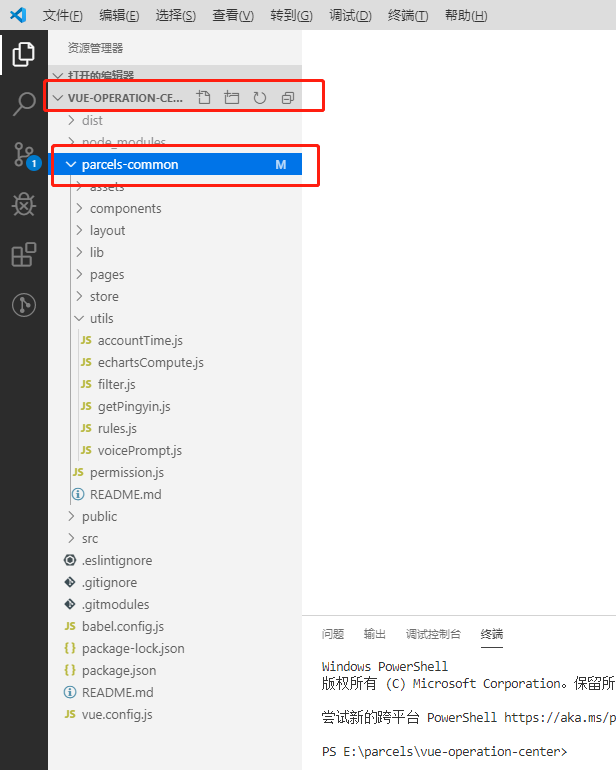
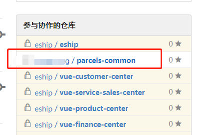

# Submodule 功能详解
::: warning
  使用场景:  当一个项目包括多个系统，且多个系统的风格保持统一的情况下，如果风格改动则要同步多个系统，且存在多个系统有公共页面的情况，我们不做复制粘贴
那么，git submodule  就是一个很好的对于 <font face="黑体" color= red  size= 5>公共资源处理方式</font>  的解决办法。


:::
## 概念
git Submodule 是一个很好的多项目使用共同类库的工具，他允许类库项目作为repository,子项目作为一个单独的git项目存在父项目中，
子项目可以有自己的独立的commit，push，pull。而父项目以Submodule的形式包含子项目。如下图:






## 使用方法?
 - <font face="黑体" color= red  size= 5>创建 submodule</font> 
 使用 git submodule add <submodule_url> 命令可以在项目中创建一个子模块。此时项目仓库中会多出两个文件：.gitmodules 和  submodule
 ```sh
  git submodule add http://192.168.8.169:8088/wangcong/parcels-common.git //子模块仓库地址
 ```
- <font face="黑体" color= red  size= 5>获取 submodule</font> 
执行上述方法后，会自动将相关代码克隆到对应路径，但对于后续开发人员而言，对于主项目使用普通的 clone 操作并不会拉取到子模块中的实际代码，
如果希望获取子模块数据，有两种方式:
```sh
   //克隆主项目的时候带上参数 --recurse-submodules
  1, git clone https://github.com/username/project-main.git  --recurse-submodules 
   // 在当前项目中执行,初始化子仓库模块
  2, git submodule update --init --recursive 
```
- <font face="黑体" color= red  size= 5>删除 submodule</font> 
```sh
  git submodule deinit submodule  (子模块的名称)
  git rm  submodule 
```

## 总结
当项目比较复杂，部分代码希望独立为子模块进行版本控制的时候，可以使用 git submodule 功能。使用 git submodule 功能时，主项目仓库并不会包含子模块的文件，
只会保留一份子模块的配置信息及版本信息，作为主项目版本管理的一部分。