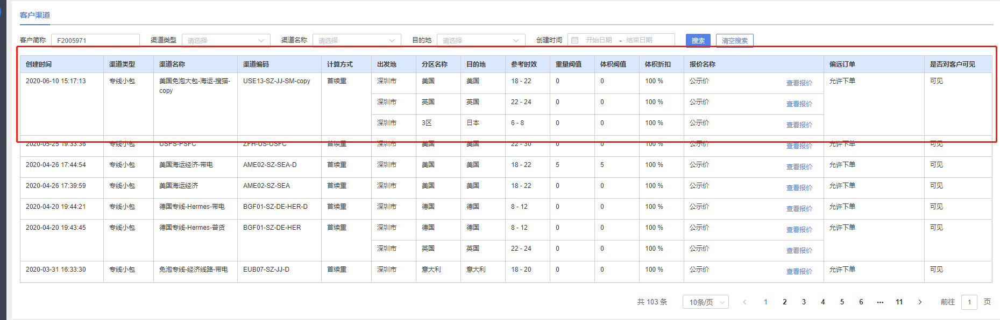

# el-table 表格合并的方法
## 实现任意表格单元项的合并 (参考 elementui span-method 方法)
实现如下图: 

实现方法:
- 1,首先在el-table 上绑定合并单元格的方法 span-method :
```sh
   <el-table border v-loading="tableDataLoading" :data="tableData" :span-method="objectSpanMethod" >
   </el-table>
```
- 2,在vuex 里定义表格行数据处理
```sh
  const state = {
    tableData:[],  //表格数据
    tableDataspanArr: {
      spanArr:[],
      pos: 0,
    }
  }
```
- 3,在获取表格数据的时候进行处理合并行
```sh
  customerViewM(state,data){
      state.tableData = data.rows
      state.tableDataspanArr.spanArr = []
      state.tableDataspanArr.pos = 0;
      for (var i = 0; i < data.rows.length; i++) {
          if (i === 0) {
            state.tableDataspanArr.spanArr.push(1);
            state.tableDataspanArr.pos = 0
          } else {
            // 判断当前元素与上一个元素是否相同
          if (data.rows[i].id === data.rows[i - 1].id) {
              state.tableDataspanArr.spanArr[state.tableDataspanArr.pos] += 1;
              state.tableDataspanArr.spanArr.push(0);
            } else {
              state.tableDataspanArr.spanArr.push(1);
              state.tableDataspanArr.pos = i;
            }
          }
      }
  }
```

- 4, 页面处理合并行方法
```sh
     objectSpanMethod({ row, column, rowIndex, columnIndex }) {
      // columnIndex --为对应的列序号
      if (columnIndex === 0 || columnIndex === 1 ) {
        const _row = this.tableDataspanArr.spanArr[rowIndex];
        const _col = _row > 0 ? 1 : 0;
        return { 
          rowspan: _row,
          colspan: _col
        }
      }
    },
```