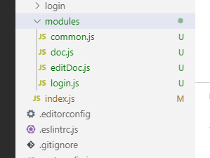
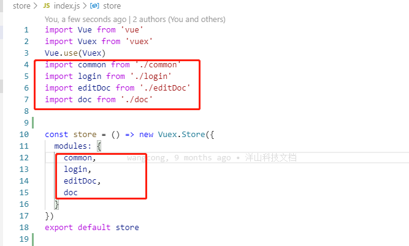

# require.context 是什么?
require.context 是 Webpack 的一个 api,通过执行这个函数获取一个特定的上下文,主要实现自动化导入模块,
在前端工程中,如果遇到从一个文件夹引入很多模块的情况,可以使用这个api,它会遍历文件夹中的指定文件,然后自动导入,使得不需要每次显式的调用import导入模块

## 使用场景




## 相关使用方法
::: warning
  以vuex 模块化管理为例(见上图),我们项目上对vuex的使用原则为一个页面对应一个js 文件,那么每次新增一个vuex 文件,就需要在index.js 中import一次
  不是很方便,为了实现自动化导入模块,因此,我们引入了 webpack 的 require.context方法
:::
  此方法返回的是一个函数,并且这个函数有3个属性
 - <font face="黑体" color= red  size= 5>resolve {Function}:</font>  接受一个参数request,request为modules文件夹下面匹配文件的相对路径,返回这个匹配文件相对于整个工程的相对路径
 - <font face="黑体" color= red  size= 5>keys {Function}: </font>    返回匹配成功模块的名字组成的数组
 - <font face="黑体" color= red  size= 5>id {String}: </font>        执行环境的id,返回的是一个字符串,主要用在module.hot.accept,应该是热加载?
```sh
  const fileNames = require.context('./modules',true,/\.js$/)  //第一个参数类型字符串(读取文件的路径)  第二个参数布尔类型(是否遍历文件的子目录), 第三个参数正则表达式(匹配文件的正则)
  console.log(fileNames.keys())  //返回匹配模块的数组
  let moduels = {}
  fileNames.keys().forEach((item) => {
  const moduleName = item.replace(/^\.\/(.*)\.\w+$/, '$1')  //获取路径名称
  const modeuleCotent = fileNames(item).default             //获取每个文件对象导出的内容
  moduels[moduleName] = modeuleCotent                       //组装vuex数据结构
})
```
- 在引入vuex 对应模块的时候用对象结构赋值的方法
```sh
    const store = () => new Vuex.Store({
      modules: {
        ...moduels
      }
    })
```