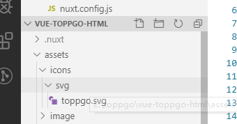
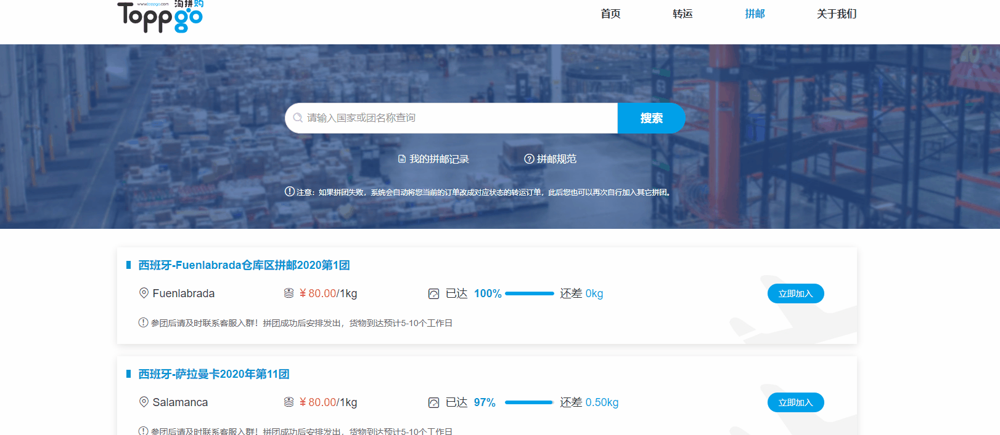

# toppgo 项目说明文档

## 项目介绍
toppgo 是一个向海外华人、留学生以及国内外采购商等提供国际转运与仓储增值服务的平台。其中包括官网首页(采用nuxt 框架搭建)，后台管理平台(采用vue框架)，手机app等三大工程。

相关网站: 

         cn.toppgo.com  (中国服务器)

         us.toppgo.com  (美国服务器)

         www.toppgo.com (欧洲服务器)


## 前端所用技术框架选型
该项目前台展示页面：采用 nuxt 技术搭建，配合 vue-i18n 进行相关国际化操作，支持三国语言(中文，韩文，英文)。

该项目后台管理系统：采用 vue2.0 搭配 vue-cli3.0 脚手架，配合vuex 状态管理器 结合webpack 打包工具，采用 scss 扩展语言构造而成。

该项目app端： 为混合APP开发，前端框架采用 mui + js 开发而成。


## 项目结构
参照 parcels 结构构建而成。

## toppgo 重要项目点
### 0,nuxt项目 + 后台vue项目共用登录登出页面
::: warning 
  业务场景:
  公司可能有两套系统，但是分别放在不同的域名下，想要共用一个登入登出功能，实现让用户感觉仿佛在使用同一个系统。
  实现逻辑：cookie下面有个设置域的属性,你把域设置成对应的域名（customer.toppgo.com）,然后只要在这个域名下面的都可以共用你的cookies了（后端操作配置）!
:::
- 在项目中区分开发环境和生产环境：

 1，根目录下创建两个文件。文件名分别为 .env.development （开发环境）和.env.production （生产环境）

 2，分别编辑这两个文件。在不同的环境下设置不同的环境变量
 
   2.1 .env.development，这是开发环境下的URL
```sh
   VUE_APP_DOMAIN_BASE_URL = http://pc.toppgo.com:2020

```

   2.2 .env.production，这是生产环境下的URL

```sh
  VUE_APP_DOMAIN_BASE_URL =  /

```

3，设置不同环境下的打包指令 （package.json文件）

```sh
      {
        "name": "vue-toppgo",
        "version": "0.1.0",
        "private": true,
        "scripts": {
          "dev": "vue-cli-service serve --mode development",
          "build": "vue-cli-service build --mode production"
        },
        ....
      }
```

4， 配置请求基本地址

```sh
   location.href = process.env.NODE_ENV === 'development' ? process.env.VUE_APP_DOMAIN_BASE_URL + '/login' : `${location.origin}/login`
```

- A 项目拥有登录页面，进行登录逻辑：

```sh
  // 登录
  async userLoginA({ commit, state }, params) {
    state.loginBtnButtonLoading = true

    try {
      let res = await userLogin(state.loginForm)
      if (res.flag) {
        let url = 'http://' + location.host + '/toppgo/home'
        window.location.href = process.env.NODE_ENV == 'development' ? 'http://customer.toppgo.com:2021/toppgo' : url
      }else{
        Notification.error({ title: '提示', message: res.msg });
      }
      state.loginBtnButtonLoading = false
    } catch(err) {
      state.loginBtnButtonLoading = false
    }
  },

```

- B 项目公用A项目的登录页面和登出页面，在路由拦截页面进行配置：

```sh

  router.beforeEach(async(to, from, next) => {

    if(/(\/login|\/regist|\/resetPassword|\/protocol)/.test(to.path)){
      next(); // 未登录,不需拦截
    }else{   // 校验是否登录(获取用户信息接口)
      axios.get(apiUrlPrefix + "/subject/isLogin").then(response => {
        if(response.data.flag){
          store.commit('login/isLoginM', response.data)
          if(to.path === "/"){
            next({ path: "/" }) // 访问根目录，定向到首页
          }else{
            next(); // 已登录
          }
        }else{
          location.href = process.env.NODE_ENV == 'development' ? `${store.state.common.VUE_APP_DOMAIN_BASE_URL}/login` :`${location.origin}/login`
        }
      }).catch(response =>{
         location.href = process.env.NODE_ENV == 'development' ? `${store.state.common.VUE_APP_DOMAIN_BASE_URL}/login` :`${location.origin}/login`
      });
    }
})

```


### 1,nuxt 中关于引入svg 图标
- 项目全局安装svg-sprite-loader：
```sh
    npm i svg-sprite-loader --save-dev
```
- 建立 svg 文件目录 (assets/icons/svg/exapmle.svg) ----如下图:



- 在components/目录下新建文件svgIcon.vue
```sh
      <template>
      <svg :class="svgClass" aria-hidden="true">
        <use :xlink:href="iconName"></use>
      </svg>
    </template>

    <script>
    export default {
      name: 'SvgIcon',
      props: {
        iconClass: {
          type: String,
          required: true,
          default: ''
        },
        className: {
          type: String,
          default: ''
        }
      },
      computed: {
        iconName() {
          return `#icon-${this.iconClass}`
        },
        svgClass() {
          if (this.className) {
            return 'svg-icon ' + this.className
          } else {
            return 'svg-icon'
          }
        }
      }
    }
    </script>

    <style scoped>
    .svg-icon {
      width: 156px;  //自定义宽高
      height: 56px;
      fill: currentColor;
      overflow: hidden;
    }
    </style>
```
- 在plugins/目录下新建文件icons.js
```sh
  import Vue from 'vue'
  import SvgIcon from '../components/svgIcon'// svg组件


  Vue.component('svg-icon', SvgIcon)

  const requireAll = requireContext => requireContext.keys().map(requireContext)

  //require.context 用法参照parcels 技术点中的 前端自动化工程

  const req = require.context('../assets/icons/svg', false, /\.svg$/)
  requireAll(req)

```
- 修改nuxt.config.js文件
```sh
const path = require('path')  //引入path 路径
module.exports = {
  // ...
  plugins: [
    // ...
    { src: '@/plugins/icons', ssr: true }
  ]
  // ...
  build: {
    // ...
    extend (config, ctx) {
      // ...
      const svgRule = config.module.rules.find(rule => rule.test.test('.svg'))
      svgRule.exclude = [path.resolve(__dirname, 'assets/icons/svg')]
      // Includes /icons/svg for svg-sprite-loader
      config.module.rules.push({
        test: /\.svg$/,
        include: [path.resolve(__dirname, 'assets/icons/svg')],
        loader: 'svg-sprite-loader',
        options: {
          symbolId: 'icon-[name]',
        },
      }) 
    }
    // ...
  }
  // ...
}

```
- vue组件中使用:
```sh
  <svg-icon icon-class="article" /> //其中 article 是图标文件的文件名（如本项目中的 toppgo）
```

### 2,nuxt 中全局动画过渡效果
::: warning
  Nuxt.js 默认使用的过渡效果名称为 page. 如果想让每一个页面的切换都有淡出 (fade) 效果，我们需要创建一个所有路由共用的 CSS 文件。所以我们可以在 assets/scss 目录下创建全局样式表: reset.scss,
  并添加如下样式即可:
:::
```sh
  /*************全局动画过渡*************/
  .page-enter-active,
  .page-leave-active {
    transition: opacity 0.2s;
  }
  .page-enter,
  .page-leave-active {
    opacity: 0;
  }
```
### 3,实现页面平滑滚动(锚点定位)
::: warning
  锚点定位:简单来讲就是让页面中某段文字在点击的时候快速定位到想要的位置，常用于高度较高的页面。
:::

效果如图下所示:



```sh
    <a  @click="scroll" style="cursor: pointer;">
         <span>拼邮规范</span>
    </a>

    <!-- 拼邮流程 -->
    <div class="spellmailProcess" id="specification">
      <div class=" w">
        <spellSubTitle :title="title1"></spellSubTitle>
        <div class="process_box">
           
        </div>
      </div>
    </div>

     scroll(){
        document.getElementById('specification').scrollIntoView({ block: 'start', behavior: 'smooth' })
      }

```
### 4,首页登录记住密码
::: warning
  实现原理: 登录的时候，如果勾选了记住密码，则把账号密码相关信息存储到cookie中，并通过使用crypto-js加密，在登录的时候进行判断是否记住了密码，如果记住密码了
  则从cookie 中读取相关账号信息。
:::
- 下载crypto-js 包
```sh
  npm install crypto-js --save-dev
```
- 在需要的文件中进行引入
```sh
  import CryptoJS from "crypto-js"
```
- 设置cookie，读取cookie 方法
```sh
    // 设置cookie
    setCookie(state,data){
      var cipherPsw = CryptoJS.AES.encrypt(data.password,'secretkey').toString();
      var exdate = new Date(); //获取时间
      exdate.setTime(exdate.getTime() + 24 * 60 * 60 * 1000 * data.setDate); //保存的天数
      //字符串拼接cookie
      window.document.cookie = "userName" + "=" + data.username + ";path=/;expires=" + exdate.toGMTString();
      window.document.cookie = "userPwd" + "=" + cipherPsw + ";path=/;expires=" + exdate.toGMTString();
  },

    //读取cookie
	  getCookie(state,data) {
      if (document.cookie.length > 0) {
        var arr = document.cookie.split('; '); //这里显示的格式需要切割一下自己可输出看下
        for (var i = 0; i < arr.length; i++) {
          var arr2 = arr[i].split('='); //再次切割
          //判断查找相对应的值
          if (arr2[0] == 'userName') {
            state.loginForm.username = arr2[1]; //保存到保存数据的地方
            state.loginForm.rememberMe=true
          } else if (arr2[0] == 'userPwd') {
            var bytes = CryptoJS.AES.decrypt(arr2[1],'secretkey');
            state.loginForm.password = bytes.toString(CryptoJS.enc.Utf8);;
          }
        }
      }
  },

    // 清除数据
    clearUser(state,data){
      state.loginForm.username=''
      state.loginForm.password = ''
      state.loginForm.captcha = ''
    },

```

- 登录的时候处理记住密码的逻辑
```sh
    async userLoginA({ commit, state }, params) {
        let res = await userLogin(state.loginForm)
        if (res.flag) {
          // 记住密码逻辑
          if(state.loginForm.rememberMe == true){
            commit('setCookie', state.loginForm)
          }else{
            commit('setCookie', {password: "",username: "",captcha:""})
            commit('clearUser')
          }
        }else{
          Notification.error({ title: '提示', message: res.msg });
        }
  },
```
- 登录页面加载获取cookie 方法
```sh
   created () {
     this.getCookie()
    },
    
```

### 5,解决苹果浏览器windows.open()页面被拦截

::: warning
  业务需求: 当window.open为用户触发事件内部或者加载时，不会被拦截，比如： 在点击事件里面直接执行则不会被拦截；
  一旦将弹出页面代码（windows.open()）移入ajax或者一段异步代码内部，浏览器就会出现被拦截提示。解决办法: 在异步调用执行前
  声明弹出框事件，再进行命名跳转地址。如下:
:::

```sh

  //定义一个打开新页面的参数
  data() {
    return {
      newWindow:null
    }
  }
  //点击事件
  payFuc () {
    // 先打开新标签
    this.newWindow = window.open("_blank");
    this.userRechargePayA()
  },

  async userRechargePayA() {
      let res = await payCostSelectPay(this.rechargeForm);
      if (res.flag) {
        if (this.rechargeForm.payType == "WeChatPal") {
          let routeData = router.resolve({
            path: "/payWechat",
            query: { id: this.rechargeForm.bizId },
          });
          // 解决苹果浏览器支付弹框被拦截
          this.newWindow.location.href = routeData.href;
          return;
        }
        // 打开新的支付宝支付界面
        this.newWindow.document.write(res.obj);
      } else {
        this.$notify.error({ title: "提示", message: res.msg });
      }
  },
  
```

### 6,vue 中关于引入svg 图标

- 安装svg-sprite-loader：npm i svg-sprite-loader --save-dev
- 建立 svg 文件目录 (assets/icons/svg/exapmle.svg) 
- 在src/components目录下新建文件svgIcon.vue
```sh
    <template>
      <svg :class="svgClass" aria-hidden="true" v-on="$listeners">
          <use :xlink:href="iconName"/>
      </svg>
  </template>

  <script>
  export default {
      name: 'svgIcon',
      props: {
          iconClass: {
              type: String,
              required: true
          },
          className: {
              type: String,
              default: ''
          }
      },
      computed: {
          iconName() {
              return `#icon-${this.iconClass}`
          },
          svgClass() {
              if (this.className) {
                  return 'svg-icon ' + this.className
              } else {
                  return 'svg-icon'
              }
          }
      }
  }
  </script>

  <style scoped>
  .svg-icon {
      width: 140px;
      height: 56px;
      fill: currentColor;
      overflow: hidden;
  }
  </style>
```

- 在src/icons目录下新建文件index.js
```sh
  import Vue from 'vue'
  import SvgIcon from '@/components/svgIcon'// svg组件

  Vue.component('svg-icon', SvgIcon)
  const req = require.context('./svg', false, /\.svg$/)
  const requireAll = requireContext => requireContext.keys().map(requireContext)
  requireAll(req)

```

- 在src/main.js文件中引入
```sh
  import './icons'
```

- 修改webpack 配置 (vue.config.js)
```sh
  chainWebpack(config) {
    // set svg-sprite-loader
    config.module
      .rule('svg')
      .exclude.add(resolve('src/icons'))
      .end()
    config.module
      .rule('icons')
      .test(/\.svg$/)
      .include.add(resolve('src/icons'))
      .end()
      .use('svg-sprite-loader')
      .loader('svg-sprite-loader')
      .options({
        symbolId: 'icon-[name]'
      })
      .end()
  },
```

- 在vue组件中使用

```sh
  <svg-icon icon-class="toppgo" />
```

### 7,vuex 模块化用法 跨模块调用方法

::: warning
  使用场景: 当在vuex 的A模块中，需要调用 B模块中的 数据或者方法时，我们可以使用vuex 中的跨模块调用方法。跨模块调用数据使用 rootState,
  跨模块使用方法可以使用  dispatch('moduleB/actionFn',{}, {root: true}。具体如下:
:::

```sh

  //获取state 里面的数据
  async unbundlingWechatA({commit,state, dispatch, rootState}, param) {
    let res = await unbundlingWechat()
    console.log(rootState.moduleA.a)   //获取模块A中的数据a
  },
 //获取 actions 里面的方法
async unbundlingWechatA({commit,state, dispatch, rootState}, param) {
    let res = await unbundlingWechat()
     dispatch('moduleA/testFuc', {}, {root: true})  // 'moduleA' 模块A  'testFuc' 模块A 中的方法
  },

```


## toppgo 项目部署说明
- 测试环境部署(192.168.8.167):
```sh
  cd /toppgo 
  sh 01-nuxt-web.sh  //更新nuxt 系统页面
  sh 02-vue-admin.sh //更新个人中心后台系统
```
- 线上环境部署(国内服务器 139.224.190.136  美国服务器 47.254.25.116  欧洲服务器  47.254.158.111 )

前端更新线上:

   1,toppgo前台页面 

     ---------先本地打包nuxt 项目(npm run build)

     ---------打包完成后复制(.nuxt nuxt.config.js package-lock.json package.json static )到对应项目目录

     ---------pm2 restart mynuxt (在对应服务器上执行)

   2,toppgo个人中心页面

     ---------本地打包(npm run build)

     ---------将本地生成的dist 文件 丢到对应线上前端项目目录

### 1,关于nuxt 部署脚本编写
```sh
  #!/bin/bash
  keyword=$1
  # 打包
  if [ -z $1 ] || [[ "nuxt-web" =~ $keyword ]];then
    echo 更新 nuxt-web.........................................................
    cd /toppgo/nuxt-toppgo-html
    git reset --hard
    git pull
    cnpm i
    echo -e '\n\n'
      echo 开始打包nuxt-web...
      cd /toppgo/nuxt-toppgo-html
      rm -rf .nuxt
      cnpm run build
      pm2 restart nuxt-toppgo
  fi
  # 运行
  echo 打包完成...
```

### 2, toppgo 前端部署

** 前端执行(测试环境)更新:  1,toppgo前台页面  
                    -------- cd  /toppgo   
                    -------- sh 01-nuxt-web.sh
                              2,toppgo个人中心页面
                    -------- cd  /toppgo   
                    -------- sh 02-vue-admin.sh
** 前端更新线上:   1,toppgo前台页面 
		              -------- cd  /toppgo  
		              -------- sh 09-online-cn-toppgo-nuxt.sh（更新 cn 服务器） 
		              -------- sh 10-online-www-toppgo-nuxt.sh（更新 www服务器） 
 		              -------- sh 11-online-us-toppgo-nuxt.sh（更新 us 服务器） 
	               2,toppgo个人中心页面
                  -------- cd  /toppgo   
                  -------- sh 08-online-vue-admin.sh (可以根据关键字更新对应服务器 cn,www,us)
