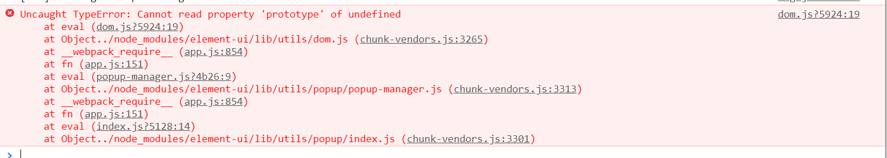

# 构建 VUE3.0项目

- 按照之前2.0 的步骤 + vue add vue-next 下载3.0对应的插件

```sh
  npm install -g @vue/cli   //vue-cli 版本大于4.0
  vue create 项目名
  cd 项目名
  vue add vue-next   //重点 执行这行,会把2.0代码改为3.0的, vue-router, vuex会变成4.0的
  npm run serve

```

## 与2.0的区别
- 变化1： main.js

```sh
  import { createApp } from 'vue';
  import App from './App.vue'
  import router from './router'
  import store from './store'
  createApp(App).use(router).use(store).mount('#app')

```

由于这里用了 import { createApp } from 'vue'; 而不是import Vue from 'vue', 所有使用一些Ui框架,以及第三方的包都会报以下的错.



解决办法：

```sh
  // 1,这是可支持3.0 的elementui
  cnpm install element-plus --save
  // 2,vue3.0 下载 antd
  cnpm install ant-design-vue

```

```sh

  import { createApp } from 'vue';
  import App from './App.vue'
  import router from './router'
  import store from './store'
  import ElementPlus from 'element-plus';
  import 'element-plus/lib/theme-chalk/index.css';
  createApp(App).use(router).use(store).use(ElementPlus).mount('#app')

  // 引入 antd
  import Antd from 'ant-design-vue'
  import 'ant-design-vue/dist/antd.css'
  createApp(App).use(router).use(store).use(Antd).mount('#app')

```

```sh
  // 页面可以直接使用
   <a-button type="primary">哈哈哈</a-button>

```

- 变化2： 生命周期不同
::: tip
  Vue2.0里常见的生命周期函数有8个,分别为.
:::

```sh
  beforeCreate,
  created,
  beforMount,
  mounted,
  beforUpdate, 
  updated,
  beforDestroy,
  desroyed

```

::: tip
  Vue3.0的生命周期函数在2.0的基础上有了些修改
:::

1,beforCreate, created,这两个函数由setup()来代替

```sh
  beforMount => onBeforMount
  mounted    => onMounted
  beforUpdate => onBeforUpdate
  updated     =>  onUpdate
  beforDestroy => onBeforUnmount
  desroyed => onUnmounted

```